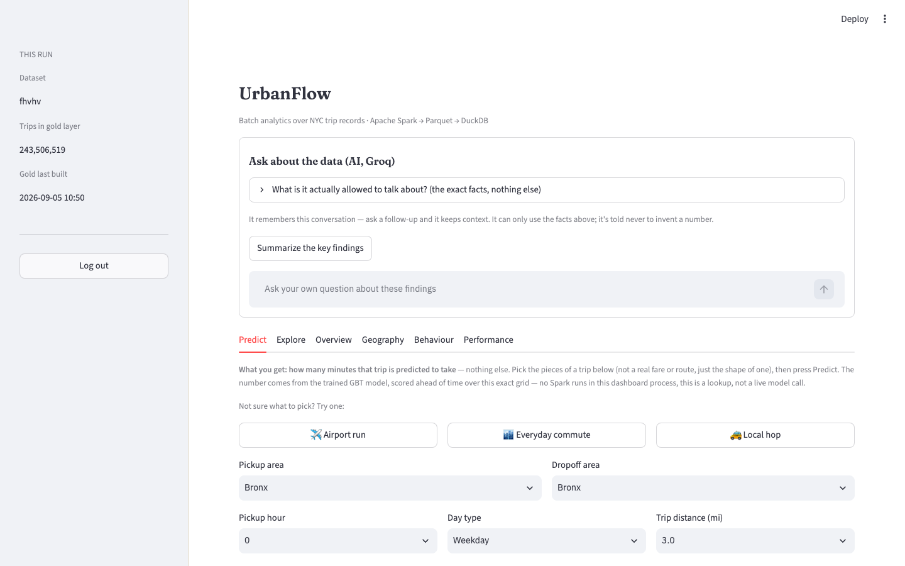
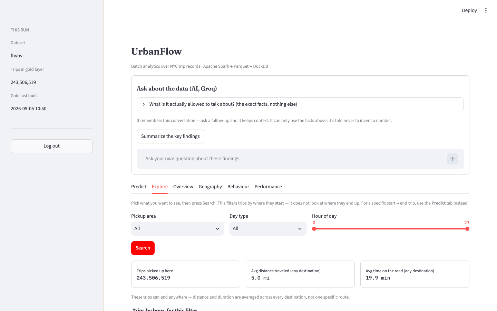
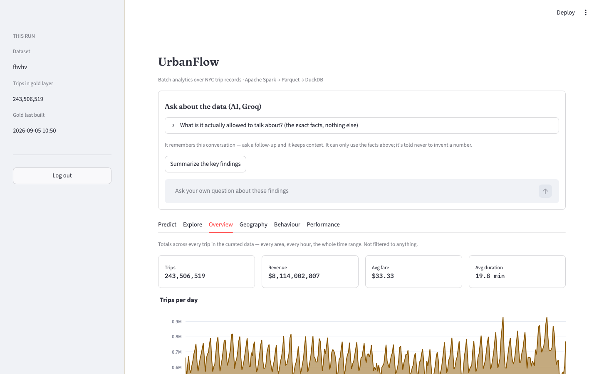
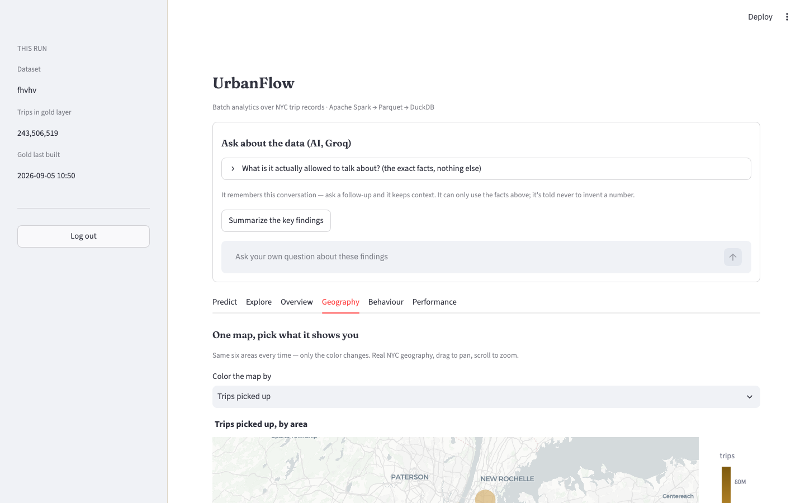
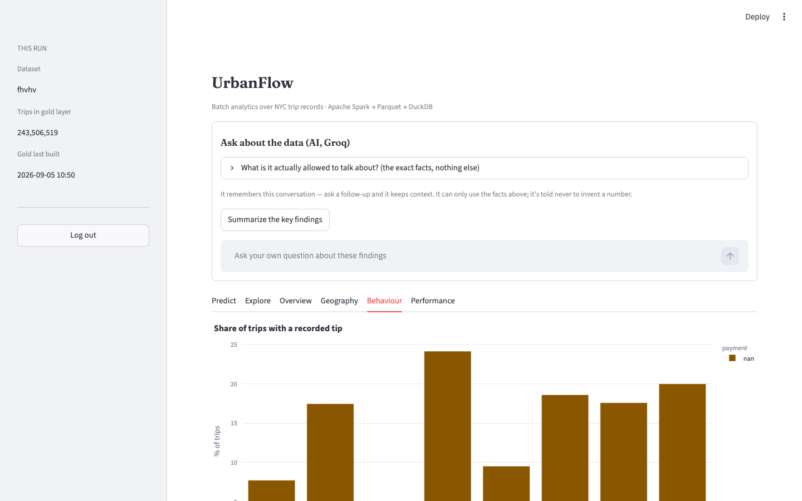
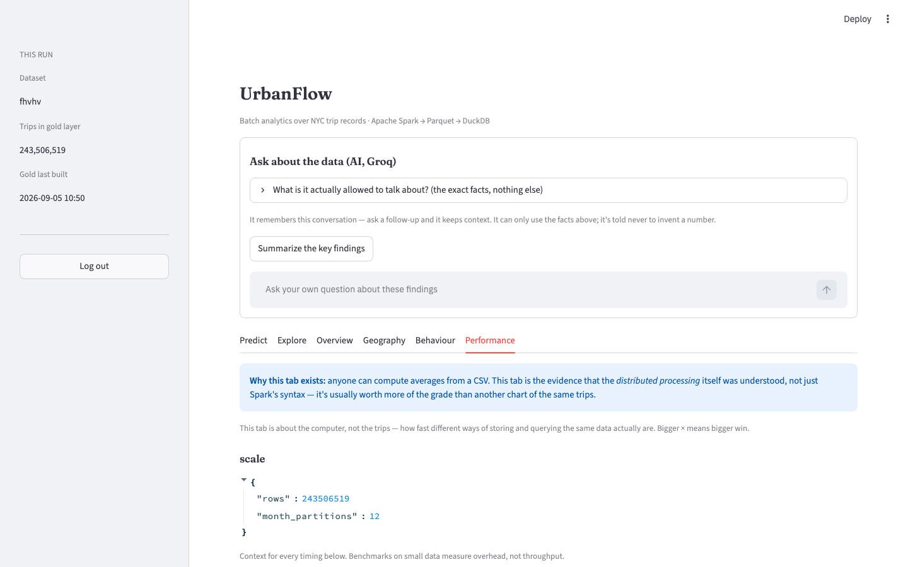
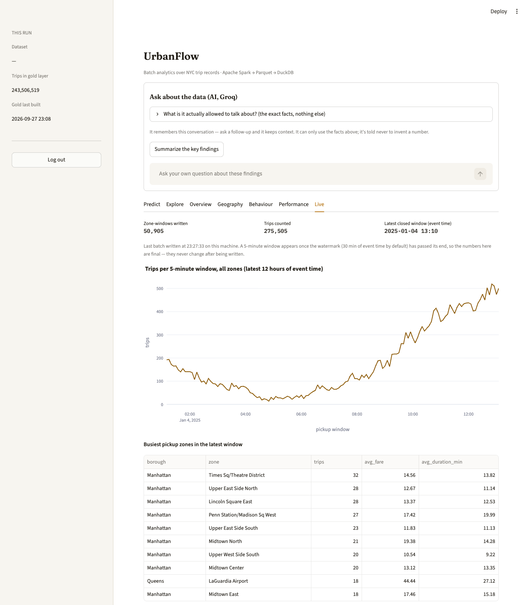

# UrbanFlow

Batch analytics over NYC TLC trip records with Apache Spark, running in
**local mode on a single laptop** — no cluster, no Hadoop, no Cassandra.
BDA semester project · three members · six weeks · 8 GB laptops.

Six stages, bronze to dashboard: ingest → curate → gold → model → benchmark →
dashboard. See [`docs/OUTCOMES.md`](docs/OUTCOMES.md) for what each stage
hands in and why it counts as "big data" despite the laptop.

Alongside the batch pipeline there is an opt-in **real-time path**: trips
replayed into Apache Kafka and aggregated live by Spark Structured Streaming
(see [Big Data ecosystem](#big-data-ecosystem)).

## Screenshots

The dashboard, running against the real 243.5M-row FHVHV gold layer:

| | |
|---|---|
| **Predict** — trip duration from a trained model, looked up not scored live | **Explore** — filter trips by area, day type, hour |
|  |  |
| **Overview** — totals across the whole curated dataset | **Geography** — real NYC map, one map many metrics |
|  |  |
| **Behaviour** — tipping patterns, card vs. cash | **Performance** — Spark scaling and format benchmarks |
|  |  |

## Requirements

* **Java 17, 21 or 25** — Spark 4.2 will not start on 8 or 11. Check with
  `java -version` before anything else; this is the most common blocker.
* **Python 3.10+** (tested on 3.12). If `python3 --version` on your machine is
  older, install a newer one (`brew install python@3.12`, `pyenv install
  3.12`, or the Microsoft Store on Windows) rather than fighting the old one.
* 25 GB free disk, 8 GB RAM (16 GB more comfortable).

## Quickstart — 10 minutes, no download required

```bash
make setup          # venv + pinned dependencies
make check          # verifies Java + Spark actually start
make synth           # 200k synthetic trips, TLC-shaped, with realistic dirt
make curate          # bronze -> silver
make gold             # the six answer tables
make test             # unit tests — run this after touching curate/
make dash             # dashboard at localhost:8501
```

`make synth` exists so all three of you can build and test the entire pipeline
on **day one**, before anyone has finished downloading 7 GB. The synthetic data
carries the same defects as the real files — stray 2001/2098 timestamps,
negative fares, teleporting taxis — so if your cleaning rules work here they
will work on the real thing.

## New developer? One-click with Docker

No Java, no Python, no `make` needed on your machine at all — just
[Docker](https://www.docker.com/products/docker-desktop/), on Windows, macOS
or Linux alike:

```bash
docker compose up --build
```

That single command builds the image (Java 21 + Python + pinned deps baked
in), downloads a real month of taxi data (Tier 0, ~55 MB), runs the whole
pipeline — curate → gold → model → bench — and brings the dashboard up at
[localhost:8501](http://localhost:8501). Data persists in a Docker volume, so
the second `docker compose up` skips straight to the dashboard.

No network, or want synthetic data instead: `INGEST=0 docker compose up --build`.

Run a different make target instead of the dashboard, e.g. just the tests:
`docker compose run --rm urbanflow test`.

This is the fastest way for a new teammate to see the whole thing working
before they've installed anything project-specific — use the dev container
below once you're actually developing rather than just demoing.

## Then switch to real data

```bash
make ingest TIER=0     # 1 month yellow      ~3.5M rows,  55 MB
make ingest TIER=1     # 24 months y+green  ~85M rows,  1.4 GB
make ingest TIER=2     # 12 months FHVHV   ~230M rows,  5.8 GB
make curate TIER=1
make gold && make model && make bench
```

Develop on Tier 0 so mistakes cost 20 seconds. Report from Tier 1.
Run Tier 2 once, in week 4, for the benchmark chapter.

## Running it on Windows, macOS or Linux

The pipeline itself is plain Python + Java and runs the same everywhere. The
**one thing that differs by OS is `make`** — it ships with macOS and every
Linux distro, but not with Windows.

**Recommended, same on all three: the dev container.** This repo ships
`.devcontainer/devcontainer.json` (Python 3.11 + Java 21 + `make`, all
pre-installed). Open the repo in VS Code with the
[Dev Containers extension](https://marketplace.visualstudio.com/items?itemName=ms-vscode-remote.remote-containers)
(or in a GitHub Codespace) and choose **"Reopen in Container"** — you get an
identical Linux environment regardless of host OS, and `make setup && make
check` just works. Requires Docker Desktop on Windows/macOS.

**Native, without Docker:**

| OS | What to do |
|---|---|
| macOS / Linux | Install Java + Python as above, then run the Quickstart commands directly in Terminal. |
| Windows | Use **WSL2** (Ubuntu) and run the Quickstart commands inside it — this is the only native path that gives you `make` and matches how the project is documented and tested. Plain PowerShell/cmd is not supported: the Makefile assumes a POSIX shell and `.venv/bin/python`, not `.venv\Scripts\python.exe`. |

All Spark sessions are created in one place (`src/urbanflow/session.py`),
which pins the Spark worker subprocesses to the exact Python interpreter
running the driver (`sys.executable`) — this avoids a real bug we hit during
testing where Spark silently picked up a different, incompatible system
Python off `PATH`. That fix is OS-independent by construction.

## Big Data ecosystem

Opt-in components that sit next to the batch pipeline. None of them is needed
for `docker compose up` or the Quickstart; each has its own compose file and
`make` targets.

### Real-time: Kafka + Spark Structured Streaming

**What:** [Apache Kafka](https://kafka.apache.org/) is a distributed,
append-only log that producers write events to and consumers read from at
their own pace. Spark Structured Streaming runs the same DataFrame code as the
batch jobs, but incrementally, on each new slice of the log.

**Why UrbanFlow uses it:** the batch path answers "what happened last
month". The streaming path answers "what is happening in each zone right
now". A producer replays real TLC trips into Kafka as live JSON events. A
Spark job cleans them with the **same seven rules** as curate, then computes
trips, average fare and average duration per pickup zone per 5-minute
event-time window. A watermark decides how late a trip may arrive and still
count.

```bash
make setup           # once — also installs kafka-python
make ingest TIER=0   # or: make synth   (the producer replays bronze)
make stream-up       # Kafka (KRaft mode, no ZooKeeper) + kafka-exporter, topics created
make stream-run      # terminal 1: the Spark streaming job (Ctrl-C to stop)
make stream-produce  # terminal 2: replay 300k trips at 2000 events/s (RATE=, LIMIT=, SKIP=)
make stream-status   # topic layout + consumer-group lag
make stream-tail     # first windowed results from the zone-metrics topic
make stream-down     # stop (keeps data) — make stream-reset wipes Kafka + data/stream
```

Results land in `data/stream/zone_metrics/` (Parquet, final windows) and on
the `zone-metrics` Kafka topic (running updates). The dashboard's **Live**
tab reads the Parquet output. For monitoring, Kafka metrics are served at
`localhost:9308/metrics` (kafka-exporter), and Spark streaming metrics at
`localhost:4050/metrics/prometheus/` while the job runs. Needs Docker for
Kafka; the producer and the Spark job run from the project venv on the host.
The full explanation, architecture and viva notes are in
[`docs/hadoop/streaming.md`](docs/hadoop/streaming.md).



## Layout

```
src/urbanflow/
  config.py            every path and URL — nothing hard-coded elsewhere
  session.py           the ONLY place a SparkSession is created
  ingest/download.py   S1 bronze — download + manifest
  ingest/synth.py      synthetic data, so work starts before the download ends
  curate/rules.py      cleaning rules, individually measurable
  curate/clean.py      S2 silver — clean, broadcast-join zones, partition
  analyze/gold.py      S3 gold — six answer tables
  analyze/model.py     S4 duration model with a naive baseline
  analyze/benchmark.py S5 format / partitioning / join / core-scaling
  dashboard/app.py     S6 Streamlit over DuckDB — no Spark in this process
  dashboard/live.py    the Live tab — reads the streaming sink, degrades to setup hints
  stream/producer.py   real-time: replay bronze trips into Kafka as JSON events
  stream/job.py        real-time: Spark Structured Streaming, windowed zone metrics
schema/curated.md      THE CONTRACT between the three of you
```

## Architecture rules that matter

* **Bronze (`data/raw/`) is immutable.** Never edit or overwrite a downloaded
  file — everything downstream must be rebuildable from it.
* **The curated schema is a contract**, frozen at the end of week 2
  (`schema/curated.md`). Changing it means telling both teammates in the same
  commit.
* **The dashboard never reads the curated layer** — only `data/gold/`, through
  DuckDB. That gap is deliberate, not a shortcut.
* **Never commit data.** `data/` is gitignored; it's reproducible from
  `data/raw/manifest.csv`.

Full gotchas (cash tips never recorded, stray 2001/2098 timestamps, why
speedup goes sub-linear) live in `docs/OUTCOMES.md`.
