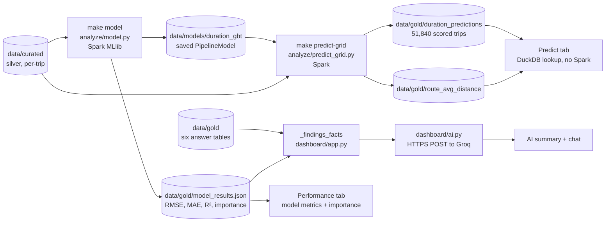

# AI / ML in UrbanFlow — how it works, and what to say about it

UrbanFlow has two "smart" pieces, and they are deliberately very different:

1. **A trained machine-learning model** (Spark MLlib, gradient-boosted trees)
   that predicts how many minutes a trip will take. Trained on the real data,
   evaluated against a naive baseline, served in the dashboard's **Predict** tab.
2. **An AI explainer** (a large language model on Groq) that turns the numbers
   the pipeline already computed into plain English, in the dashboard's
   **Ask about the data** box. It never sees the raw data and does no analysis
   of its own.

The model is the analytics. The AI is a presentation layer on top of it.

## Where each piece sits in the pipeline



Spark runs only in the two batch steps (`make model`, `make predict-grid`).
The dashboard process never starts Spark: it reads small Parquet/JSON files
through DuckDB, so it opens instantly.

## Part 1 — the trip-duration model (`src/urbanflow/analyze/model.py`)

### The question
"Given where a trip starts and ends, when it starts, and how far it goes, how
long will it take?" This is a **regression** problem: the answer is a number
of minutes, not a category.

### Inputs (features) and output (label)

| Feature | Type | Where it comes from |
|---|---|---|
| `trip_distance` | number (miles) | the trip record |
| `pickup_hour` | number 0–23 | derived in curate from `pickup_ts` |
| `pickup_dow` | number 1–7 (1 = Sunday) | derived in curate (Spark's `dayofweek`) |
| `passenger_count` | number | yellow/green only; FHVHV has no such field, so it is dropped for that dataset |
| `pu_borough` | category | pickup zone → borough, via the zone lookup join |
| `do_borough` | category | dropoff zone → borough |
| **label:** `duration_min` | number (minutes) | `dropoff_ts − pickup_ts` |

### The Spark ML pipeline

`build_pipeline()` chains five stages into one `Pipeline`, so the exact same
preprocessing runs at training time and at prediction time:

1. **`StringIndexer` × 2**: turns each borough name into a number (Manhattan → 0,
   and so on). `handleInvalid="keep"` means a borough never seen in training
   still gets scored (it goes into an extra "unknown" bucket) instead of crashing.
2. **`OneHotEncoder`**: turns each borough index into a vector of 0/1 flags.
   This stops the model reading "Queens = 2" as "twice Brooklyn".
3. **`VectorAssembler`**: packs all features into the single `features` vector
   Spark ML expects.
4. **`GBTRegressor`**: 30 boosted decision trees (`maxIter=30`), each at most
   5 levels deep (`maxDepth=5`), `seed=42` so reruns are reproducible.

**Boosting, in one sentence:** tree 1 makes a rough guess, tree 2 is trained on
tree 1's mistakes, tree 3 on what is still wrong, and so on. The final
prediction is the sum of all 30 trees.

### Two things that make the result honest

1. **Time-based split, not random.** The earliest 80% of trips (by pickup
   time) are training data and the latest 20% are test data. A random split
   would let the model learn from the future to predict the past, which
   inflates the score.
2. **A naive baseline to beat.** Predict `distance ÷ average training speed`.
   If the model can't beat that, it has learned nothing useful, and the
   project says so.

### Metrics

All three are computed on the **test** trips only, which the model never saw:

* **RMSE** (root mean squared error): typical error in minutes. Big misses
  count extra because the errors are squared. This is the headline number.
* **MAE** (mean absolute error): the average miss in minutes, every error
  weighted equally. It is always ≤ RMSE, and the gap between them shows how
  much of the error comes from a few big misses.
* **R²**: the share of the variation in trip duration that the model explains
  (1.0 = perfect, 0 = no better than always guessing the average).
* **improvement_pct**: how much lower the model's RMSE is than the baseline's.

Real Tier 2 result (FHVHV 2025, 243.5M curated trips; 194.8M train / 48.7M test):

| | RMSE | MAE | R² |
|---|---|---|---|
| Baseline (distance ÷ mean speed) | 16.44 min | 8.98 min | — |
| GBT model | **7.10 min** | **4.51 min** | **0.765** |

The model's RMSE is **56.8% lower** than the baseline's. The baseline's RMSE is almost
twice its MAE, which means a few very wrong guesses drive most of its error.
Those are trips where one citywide average speed is badly off, such as
Manhattan at rush hour or a highway run at night. Hour of day and borough fix
most of that.

### Feature importance

GBT reports how much each input was used to split the trees. The numbers add
up to 1. Real Tier 2 model, recomputed from the saved model with
`python -m urbanflow.analyze.model --importance-only` (see the bug note below):

| Feature | Importance |
|---|---|
| `trip_distance` | 0.6426 |
| `pickup_hour` | 0.1714 |
| `do_borough` | 0.0886 |
| `pickup_dow` | 0.0529 |
| `pu_borough` | 0.0446 |

Distance dominates, which is what you would expect. Hour of day comes next,
because the same trip takes longer at rush hour. Dropoff borough matters
about twice as much as pickup borough. Its biggest single slots are "ends in
Manhattan" (0.034), "ends in Brooklyn" (0.023) and "ends at EWR airport"
(0.013).

**Bug fixed during verification:** the one-hot encoder turns each borough
column into several vector slots, one per borough (19 slots in total for the
Tier 2 model). The old code labelled only the first five *slots* with the
five feature *names*. So the two "borough" rows in the original
`model_results.json` (`do_borough_v 0.0136`, `pu_borough_v 0.0105`) were
really the single "pickup in Brooklyn" and "pickup in Manhattan" flags. The
dropoff borough's real contribution (0.0886) was missing, and the listed
importances added up to 0.89 instead of 1. `feature_importance()` now
reads the slot names from the assembled vector's metadata and sums every slot
back into the feature it came from (`tests/test_model.py` pins this down).

## Part 2 — the Predict tab (`src/urbanflow/analyze/predict_grid.py`)

The dashboard has no Spark, but the saved model can only be run by Spark. So
`make predict-grid` scores the model **once, ahead of time**, over every
combination the Predict tab lets you pick:

24 hours × 2 day types (Wednesday = weekday, Saturday = weekend) × 30
distances (1–30 miles) × 6 pickup boroughs × 6 dropoff boroughs =
**51,840 predictions**, saved as `data/gold/duration_predictions`.

When you press **Predict duration**, the dashboard does an exact-match lookup
in that table (a pandas filter on the DuckDB-loaded frame). Because the
dropdowns only offer values that exist in the grid, there is no
"nearest match" guessing. `route_avg_distance` (the real average distance per
borough pair, from the curated data) is only used to pre-select a sensible
distance for the chosen route.

Pipeline wiring: `make all` and the Docker entrypoint both run
`predict-grid` right after `model`. (Before this fix the Docker path skipped
it, so a fresh `docker compose up` showed an empty Predict tab. The entrypoint
also fills that gap on an existing volume that has a model but no grid.)

## Part 3 — the AI summary and chat (`src/urbanflow/dashboard/ai.py`)

### What the AI is allowed to know
`_findings_facts()` in `dashboard/app.py` builds a short list of facts from
the gold tables, `model_results.json` and `benchmarks.json`. The list covers
total trips, revenue, the tip share (card vs cash for yellow/green, or one
overall share for FHVHV, which has no payment type), the slowest and fastest hour,
the model's error vs baseline and its top feature, and the benchmark
speedups. That list is **the only data the AI receives**. The dashboard shows
the same list in an expander ("What is it actually allowed to talk about?"),
so anyone can check every sentence against its source.

### The call
One HTTPS `POST` to Groq's OpenAI-compatible endpoint
`https://api.groq.com/openai/v1/chat/completions`, using Python's standard
library (`urllib`, no SDK):

```json
{
  "model": "openai/gpt-oss-20b",
  "messages": [
    {"role": "system", "content": "Explain in plain English... only use the facts below — never invent a number...\n\nFacts:\n..."},
    {"role": "user", "content": "Summarize the most interesting findings..."},
    {"role": "assistant", "content": "..."},
    {"role": "user", "content": "follow-up question"}
  ],
  "temperature": 0.3,
  "max_tokens": 600,
  "reasoning_effort": "low"
}
```

* **"Memory"** is just resending the whole conversation each time. Groq keeps
  no state between calls.
* **`temperature: 0.3`** keeps answers factual rather than creative.
* **`reasoning_effort: "low"`** (sent only for `gpt-oss` models): these models
  think before answering, and that hidden thinking uses the same token
  budget. A few facts need little thinking, so this leaves the budget for the
  visible answer.
* **Model:** `openai/gpt-oss-20b`, a Groq production model (checked
  2026-09-27 against Groq's models and deprecations pages). Override it with
  `GROQ_MODEL=...` in `.env` if Groq ever retires it.

### Setting the key
Copy `.env.example` to `.env` (gitignored, never committed) and fill in
`GROQ_API_KEY` (free at console.groq.com). Docker Compose passes it into the
container. `make dash` reads the same `.env` via `load_dotenv()` (before this
fix, the native path ignored `.env`, so the key never reached the dashboard
unless you exported it by hand). A key already set in your shell takes
priority.

### What happens when things go wrong
| Situation | What the user sees |
|---|---|
| No key set | "No `GROQ_API_KEY` is set…". The rest of the dashboard works normally. |
| Wrong key, retired model, rate limit | "Couldn't reach Groq: HTTP 401: Invalid API Key" (Groq's own message, not just the status code) |
| Network down | "Couldn't reach Groq: <urlopen error …>" |
| Model used its whole budget thinking | "…the model returned an empty answer… try asking again" rather than a blank reply |

## Likely viva questions

**Why gradient-boosted trees and not linear regression?** Duration isn't
linear in its inputs. The same mile takes far longer in Manhattan at 5 pm
than on a highway at 3 am. Trees learn those interactions (distance × hour ×
borough) without us having to spell them out, and Spark MLlib trains them in
parallel over hundreds of millions of rows.

**Why a time-based split?** Deployment means predicting future trips from
past ones. A random split mixes the future into training (leakage) and
reports a score you could never get in real use.

**Is 57% over the baseline good?** It's a real improvement: typical error
drops from ~16 to ~7 minutes. The remaining 7 minutes come from what the
model can't see: exact zones (it only knows boroughs), traffic incidents,
weather, and driver behaviour.

**Why precompute predictions instead of calling the model live?** The
dashboard is Spark-free by design, so it opens in milliseconds. Loading Spark
per request would take seconds and gigabytes. A 51,840-row lookup table
covers every choice the UI offers, exactly.

**Is the AI doing the analysis?** No. Spark computes every number. The LLM
only rephrases a fixed fact list, and it's told never to invent a number.
Remove the key and every chart and metric is still there.

**What would you improve?** Use zone-level (265 zones) instead of borough-level
location, add weather and holiday features, tune `maxIter`/`maxDepth` with
cross-validation on the training period, and report error per borough.

## Commands

```bash
make synth curate gold     # data to train on (synthetic; or make ingest TIER=0 first)
make model                 # train + evaluate -> data/models/duration_gbt, data/gold/model_results.json
make predict-grid          # score the grid  -> data/gold/duration_predictions
make dash                  # Predict + Performance tabs, AI box (needs GROQ_API_KEY in .env)
make test                  # includes tests/test_model.py and tests/test_ai.py

# fix feature_importance in an older model_results.json without retraining
PYTHONPATH=src .venv/bin/python -m urbanflow.analyze.model --importance-only
```
