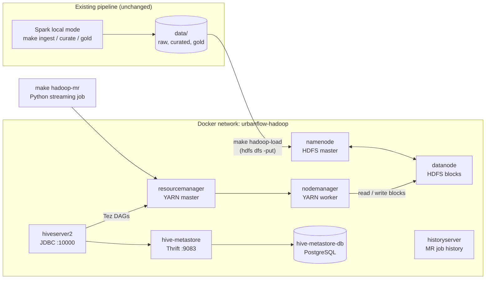
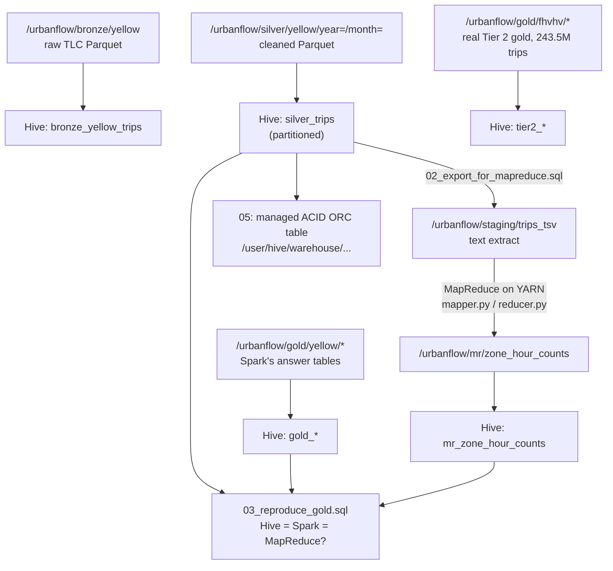

# UrbanFlow on the Hadoop ecosystem

The main UrbanFlow pipeline is Spark in local mode on one laptop (see the
top-level [README](../../README.md)). This folder documents the **opt-in
Hadoop stack** that runs beside it: the same bronze, silver and gold data,
stored in **HDFS**, processed by a **MapReduce** job scheduled by **YARN**,
and queried with **Hive**, whose catalogue lives in a **PostgreSQL**-backed
metastore.

Nothing in the Spark pipeline or the dashboard changes. The Hadoop stack
reads what the pipeline already produced in `data/` and gives the same
answers through different engines, which is the point: the numbers are
reproducible whichever tool computes them.

| Component | What it is | Doc |
|---|---|---|
| HDFS | Distributed file system: the data lake's storage | [hdfs.md](hdfs.md) |
| YARN | Cluster resource manager: runs every job's tasks in containers | [yarn.md](yarn.md) |
| MapReduce | Batch processing model: our Python map/reduce job | [mapreduce.md](mapreduce.md) |
| Hive (+ metastore, Tez) | SQL over files in HDFS | [hive.md](hive.md) |

## Architecture



Eight containers from three images: `apache/hadoop:3.4.1` (all five Hadoop
daemons), `apache/hive:4.0.1` (metastore and HiveServer2), and a pinned
`postgres:16.4-alpine` for the metastore database.

## Data flow



## Run it

Needs Docker (about 6.5 GB of images on first pull; give Docker at least
8 GB of RAM) and the local data layers. From the repository root:

```bash
make synth curate gold        # or: make ingest TIER=0 && make curate && make gold
make hadoop-up                # start the 8 containers (~2 minutes), init HDFS, upload Tez
make hadoop-demo              # load HDFS, create Hive tables, run MapReduce, run the HiveQL
make hadoop-down              # stop; HDFS and metastore data stay in Docker volumes
```

The demo steps can also be run one at a time:

| Target | What it does |
|---|---|
| `make hadoop-load` | copies the yellow dataset's `data/raw`, `data/curated`, `data/gold` into HDFS (the Hive tables are declared over the yellow layout); prints `ls`, `du`, replication and block info |
| `make tier2-data` | clones the real Tier 2 (243.5M-trip) gold tables and model predictions (`Urbanflow-BDA-data`, ~340 KB) into `external/`; a Codespace does this on creation. `make hadoop-load` then loads them too. A copy elsewhere: `make hadoop-load TIER2_GOLD=/path/to/Urbanflow-BDA-data/data/gold` |
| `make hive-tables` | declares the Hive tables (`hive/queries/01_create_tables.sql`) |
| `make hadoop-mr` | Hive writes a text extract, then the MapReduce job runs on YARN |
| `make hive-query` | runs `hive/queries/03`, `04`, `05` and prints the results |
| `make hadoop-status` | containers, HDFS capacity, YARN nodes, recent applications |
| `make hadoop-clean` | stop AND delete the HDFS and metastore volumes |

Web UIs while it runs (host ports are bound to `127.0.0.1` only and offset
from the Hadoop defaults so they never clash with another Hadoop or HBase
stack; override with the `UF_*_PORT` variables in `docker-compose.hadoop.yml`):

| UI | URL |
|---|---|
| HDFS NameNode | http://localhost:19870 |
| YARN ResourceManager | http://localhost:18088 |
| MapReduce JobHistory | http://localhost:19888 |
| HiveServer2 | http://localhost:20002 |

An interactive Hive shell: `docker compose -p urbanflow-hadoop -f
docker-compose.hadoop.yml exec hiveserver2 beeline -u
jdbc:hive2://localhost:10000/urbanflow -n hive`.

## Monitoring endpoints

Every service is on the Docker network **`urbanflow-hadoop`** (a fixed name,
not prefixed by Compose), under its service name. A Prometheus container
joined to that network can scrape these directly:

| Service (DNS name) | Metrics URL | Source |
|---|---|---|
| `namenode` | `http://namenode:9870/prom` | Hadoop's built-in Prometheus endpoint (`hadoop.prometheus.endpoint.enabled` in `core-site.xml`) |
| `datanode` | `http://datanode:9864/prom` | same |
| `resourcemanager` | `http://resourcemanager:8088/prom` | same |
| `nodemanager` | `http://nodemanager:8042/prom` | same |
| `historyserver` | `http://historyserver:19888/prom` | same |
| `hive-metastore` | `http://hive-metastore:9404/metrics` | Prometheus JMX exporter java agent (`hadoop/jmx/hive-jmx-exporter.yml`) |
| `hiveserver2` | `http://hiveserver2:9404/metrics` | same |
| `hive-metastore-db` | none (Postgres on `5432`; add a postgres_exporter if needed) | |

Every Hadoop daemon also serves raw JMX as JSON at `/jmx` on the same port.
Example series: `fs_namesystem_files_total`, `fs_namesystem_blocks_total`
(NameNode), `cluster_metrics_num_active_n_ms`, `queue_metrics_apps_running`
(ResourceManager), `node_manager_metrics_containers_launched` (NodeManager),
`jvm_memory_used_bytes` (Hive).

## Honest limits

* **One machine, one of everything.** One DataNode means replication factor
  1; one NodeManager means no real parallelism across machines. The daemons,
  protocols and commands are the real ones, so the same setup scales out by
  adding DataNode/NodeManager containers on more hosts.
* **Apple silicon runs the Hadoop image emulated.** `apache/hadoop` is
  published for amd64 only. It works under Docker Desktop's Rosetta
  emulation, but slower, and Java 8's default `vfork` process launch can
  hang there; the stack sets `-Djdk.lang.Process.launchMechanism=FORK`
  (harmless on x86) to avoid it. The Hive and Postgres images are native.
* **Hive uses Tez, not MapReduce.** Hive 4 deprecates its MapReduce engine
  (and it fails on some queries); Tez is its supported engine and runs on the
  same YARN cluster. Our own job in `hadoop/mapreduce/` is classic MapReduce.
* **No security.** No Kerberos, HDFS permission checks off, a demo Postgres
  password. Fine on a laptop, never on a shared network.
