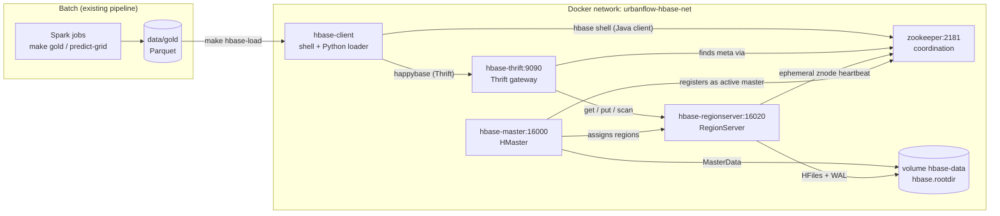

# HBase + ZooKeeper — UrbanFlow's serving layer

**One line:** Spark computes the gold tables in batch; HBase serves them
back by key in milliseconds; ZooKeeper is how the HBase processes find and
watch each other.

## Contents

1. [Why HBase in this project](#1-why-hbase-in-this-project)
2. [Architecture](#2-architecture)
3. [Running it](#3-running-it)
4. [Table and row-key design](#4-table-and-row-key-design)
5. [ZooKeeper's role, concretely](#5-zookeepers-role-concretely)
6. [Pointing HBase at HDFS](#6-pointing-hbase-at-hdfs)
7. [Metrics for Prometheus](#7-metrics-for-prometheus)
8. [Viva questions](#8-viva-questions)
9. [Files](#9-files)

## 1. Why HBase in this project

The pipeline answers questions in batch: Spark reads hundreds of millions of
trips and writes small gold tables (`data/gold/`). A batch job is the wrong
tool for "how busy is JFK on weekdays at 17:00?" or "how long will a 10-mile
Manhattan → Queens trip take at 08:00?". Those are **lookups by key** that an
app needs answered in milliseconds, possibly thousands of times a second.

HBase is the Hadoop ecosystem's answer to that: a distributed, sorted,
key-value store, modelled on Google's Bigtable, that stores its files on
HDFS. It gives:

* **Fast point reads and writes by row key**, and fast scans over a
  contiguous key range. Nothing else. No joins, no SQL, no secondary indexes.
* **Horizontal scale.** A table is cut into *regions* (key ranges), and
  regions are spread across RegionServers. Add servers, and regions move to
  them.
* **Strong consistency per row.** Every row is served by exactly one
  RegionServer, so a read always sees the latest write to that row.

So the split in UrbanFlow is:

| Layer | Tool | Access pattern |
|---|---|---|
| Batch compute | Spark | full scans, aggregations, model training |
| Analytics / dashboard | DuckDB over Parquet | ad-hoc SQL over small gold tables |
| **Serving** | **HBase** | **get / scan by key, low latency** |

The Streamlit dashboard still reads Parquet through DuckDB. HBase is an
extra serving path over the same gold output, the part a real-time app or API
would call.

## 2. Architecture



What each container is:

| Service | Process | Job |
|---|---|---|
| `zookeeper` | Apache ZooKeeper 3.8.6 server (the copy bundled in the HBase release, started with `hbase zookeeper`) | Holds the small shared state the cluster agrees on: who the active master is, which RegionServers are alive, where `hbase:meta` lives. |
| `hbase-master` | HMaster | Cluster manager: creates/deletes tables, assigns regions to RegionServers, rebalances, reacts when a RegionServer dies. **Not** on the read/write path. |
| `hbase-regionserver` | HRegionServer | Serves the data. Keeps writes in a MemStore (RAM) + WAL (log on disk), flushes them to HFiles, answers gets and scans. |
| `hbase-thrift` | Thrift server | A gateway so non-Java clients (Python here) can use HBase. It is an HBase client itself. |
| `hbase-client` | on demand only | The "edge node": runs the HBase shell and the Python loader/queries, then exits. |

Every service runs the same image (`docker/hbase/Dockerfile`: Eclipse
Temurin JRE 11 + the official Apache HBase 2.5.15 `-hadoop3` release, checksum
verified, + Python with `happybase` and `pyarrow`). They share one config file,
`docker/hbase/hbase-site.xml`, which is mounted in, so editing it needs a
restart, not a rebuild. ZooKeeper is still its own container and its own
process, exactly as on a real cluster. Reusing the ZooKeeper server that ships
inside HBase just avoids a second image.

**How a read finds its data** (what to say if asked "how does a client know
which server to ask?"):

1. The client asks ZooKeeper where the `hbase:meta` table is
   (`/hbase/meta-region-server`).
2. It reads `hbase:meta`, which maps key ranges to regions to RegionServers.
3. It sends the get or scan straight to that RegionServer, and caches the
   location so later requests skip steps 1 and 2.

The master is not involved at all, which is why reads keep working for a
while even if the master is down.

**How a write is stored:** the RegionServer appends it to the WAL (for
crash recovery), puts it in the MemStore, and acknowledges. When the MemStore
fills, it is flushed to a new sorted HFile. Background *compactions* merge
HFiles. Data is always sorted by row key, which is why key design matters.

## 3. Running it

Prerequisites: Docker, and a gold layer in `data/gold/` (`make gold && make
predict-grid`, or a prepared gold layer copied into `data/gold/`). If you set
`URBANFLOW_DATA`, the load reads `$URBANFLOW_DATA/gold` instead. The first
`make hbase-up` builds the image (~1.4 GB, it downloads the ~370 MB HBase
release once) and fetches the ~3 MB Prometheus JMX exporter agent into
`docker/hbase/jmx-exporter/` (gitignored). The stack needs about 3 GB of RAM.
After changing the Dockerfile, rebuild with
`docker compose -f docker-compose.hbase.yml build`.

```bash
make hbase-up      # ZooKeeper + HMaster + RegionServer + Thrift; waits until healthy
make hbase-load    # create namespace + tables (HBase shell), load gold (Python)
make hbase-query   # gets / scans / counts, first in the HBase shell, then from Python
make hbase-zk      # what HBase keeps in ZooKeeper
make hbase-shell   # interactive HBase shell, try your own commands
make hbase-down    # stop (data kept in the volume)
make hbase-clean   # stop and delete the HBase + ZooKeeper volumes
```

Custom Python queries:

```bash
docker compose -f docker-compose.hbase.yml run --rm hbase-client \
  python3 -m urbanflow.hbase.query demand --zone "Times Sq/Theatre District" --day weekend
docker compose -f docker-compose.hbase.yml run --rm hbase-client \
  python3 -m urbanflow.hbase.query predict --from Brooklyn --to Manhattan --day weekday --hour 18 --miles 6
docker compose -f docker-compose.hbase.yml run --rm hbase-client \
  python3 -m urbanflow.hbase.query daily --month 2025-07
```

Or from your own venv against the host-mapped Thrift port:
`.venv/bin/pip install -r requirements-hbase.txt`, then
`HBASE_THRIFT_PORT=19090 PYTHONPATH=src .venv/bin/python -m urbanflow.hbase.query demo`.

Web UIs: HMaster <http://localhost:16010>, RegionServer
<http://localhost:16030>. Host ports are bound to `127.0.0.1` only, and can be
changed with environment variables if something else already uses them (see
the `ports:` lines in `docker-compose.hbase.yml`).

### Real output from this machine

Loaded from the real Tier 2 gold layer (12 months of FHVHV, 243.5M trips):

```text
$ make hbase-load
... hbase shell -n /app/scripts/hbase/create_tables.rb
Created table urbanflow:demand
Created table urbanflow:duration_pred
Created table urbanflow:daily_kpis
=> ["daily_kpis", "demand", "duration_pred"]
... python3 -m urbanflow.hbase.load
  demand_by_zone_hour    -> urbanflow:demand          12,445 rows    1.5s
  duration_predictions   -> urbanflow:duration_pred   51,840 rows    1.0s
  daily_kpis             -> urbanflow:daily_kpis         365 rows    0.0s
```

HBase shell (trimmed):

```text
hbase:004:0> status 'simple'
active master:  hbase-master:16000 1790531529032
0 backup masters
1 live servers
    urbanflow-hbase-hbase-regionserver-1.urbanflow-hbase-net:16020 1790531195430
        requestsPerSecond=0.0, numberOfOnlineRegions=10, usedHeapMB=154, maxHeapMB=1024, ...

hbase:008:0> get 'urbanflow:demand', 'JFK Airport#weekday#17'
COLUMN  CELL
 m:avg_distance timestamp=2026-09-27T17:56:01.301, value=17.522
 m:avg_duration_min timestamp=2026-09-27T17:56:01.301, value=57.85
 m:trips timestamp=2026-09-27T17:56:01.301, value=147705
 z:borough timestamp=2026-09-27T17:56:01.301, value=Queens
 z:daytype timestamp=2026-09-27T17:56:01.301, value=weekday
 z:hour timestamp=2026-09-27T17:56:01.301, value=17
 z:zone timestamp=2026-09-27T17:56:01.301, value=JFK Airport
1 row(s)
Took 0.1435 seconds

hbase:012:0> scan 'urbanflow:demand', {ROWPREFIXFILTER => 'JFK Airport#weekday#', COLUMNS => ['m:trips'], LIMIT => 6}
ROW  COLUMN+CELL
 JFK Airport#weekday#00 column=m:trips, timestamp=2026-09-27T17:56:01.301, value=180109
 JFK Airport#weekday#01 column=m:trips, timestamp=2026-09-27T17:56:01.301, value=104295
 JFK Airport#weekday#02 column=m:trips, timestamp=2026-09-27T17:56:01.476, value=48991
 ...
6 row(s)

hbase:015:0> scan 'urbanflow:demand', {FILTER => "PrefixFilter('Times Sq/Theatre District#weekend#2')", COLUMNS => ['m:trips']}
 Times Sq/Theatre District#weekend#20 column=m:trips, ..., value=36609
 Times Sq/Theatre District#weekend#21 column=m:trips, ..., value=43669
 Times Sq/Theatre District#weekend#22 column=m:trips, ..., value=52303
 Times Sq/Theatre District#weekend#23 column=m:trips, ..., value=47518
4 row(s)

hbase:018:0> get 'urbanflow:duration_pred', 'Manhattan#Queens#weekday#08#10.0'
 p:minutes timestamp=2026-09-27T17:56:02.451, value=34.7
1 row(s)
Took 0.0063 seconds

hbase:022:0> scan 'urbanflow:daily_kpis', {STARTROW => '2025-03-01', STOPROW => '2025-03-08', COLUMNS => ['k:trips', 'k:revenue']}
 2025-03-01 column=k:revenue, ..., value=25228531.06
 2025-03-01 column=k:trips, ..., value=789509
 ...
7 row(s)

hbase:025:0> count 'urbanflow:demand', INTERVAL => 5000, CACHE => 1000
Current count: 5000, row: Great Kills#weekend#09
Current count: 10000, row: Soundview/Castle Hill#weekday#02
12445 row(s)
hbase:026:0> count 'urbanflow:duration_pred', INTERVAL => 20000, CACHE => 5000
51840 row(s)
hbase:027:0> count 'urbanflow:daily_kpis'
365 row(s)

hbase:028:0> list_regions 'urbanflow:duration_pred'
 SERVER_NAME                                  | REGION_NAME                                  | START_KEY     | END_KEY
 urbanflow-hbase-hbase-regionserver-1...16020 | urbanflow:duration_pred,,1790531757309...    |               | Brooklyn
 urbanflow-hbase-hbase-regionserver-1...16020 | urbanflow:duration_pred,Brooklyn,...         | Brooklyn      | EWR
 urbanflow-hbase-hbase-regionserver-1...16020 | urbanflow:duration_pred,EWR,...              | EWR           | Manhattan
 urbanflow-hbase-hbase-regionserver-1...16020 | urbanflow:duration_pred,Manhattan,...        | Manhattan     | Queens
 urbanflow-hbase-hbase-regionserver-1...16020 | urbanflow:duration_pred,Queens,...           | Queens        | Staten Island
 urbanflow-hbase-hbase-regionserver-1...16020 | urbanflow:duration_pred,Staten Island,...    | Staten Island |
 6 rows
```

Python over Thrift (the first request of each run includes opening the
connection and looking up region locations; after that a point get takes ~4 ms):

```text
-- GET urbanflow:demand 'JFK Airport#weekday#17'  (49.9 ms)
   {'m:avg_distance': '17.522', 'm:avg_duration_min': '57.85', 'm:trips': '147705', 'z:borough': 'Queens', ...}
-- SCAN urbanflow:demand prefix 'JFK Airport#weekday#' family m  (39.9 ms)
   JFK Airport#weekday#00                   trips=  180109  avg_min=35.19
   JFK Airport#weekday#01                   trips=  104295  avg_min=31.88
   ...
   JFK Airport#weekday#23                   trips=  183507  avg_min=38.9
   24 rows; busiest hour: 22:00 with 195,048 trips
-- GET urbanflow:duration_pred 'Manhattan#Queens#weekday#08#10.0'  (3.9 ms)
   predicted duration: 34.7 min
-- SCAN urbanflow:duration_pred prefix 'Manhattan#Queens#weekday#08#'  (7.7 ms)
   Manhattan#Queens#weekday#08#01.0                8.7 min
   Manhattan#Queens#weekday#08#06.0               25.7 min
   Manhattan#Queens#weekday#08#11.0               34.7 min
   Manhattan#Queens#weekday#08#16.0               47.3 min
   Manhattan#Queens#weekday#08#21.0               54.4 min
   Manhattan#Queens#weekday#08#26.0               54.4 min
   30 rows (every 5th shown): the model's duration-vs-distance curve
-- SCAN urbanflow:daily_kpis STARTROW '2025-03-01' STOPROW '2025-04-01'  (10.7 ms)
   31 days  20,531,806 trips  $697,909,819 revenue
   busiest day: 2025-03-01 with 789,509 trips
-- COUNT urbanflow:demand  (154.5 ms)
   12,445 rows
-- COUNT urbanflow:duration_pred  (295.3 ms)
   51,840 rows
-- COUNT urbanflow:daily_kpis  (5.3 ms)
   365 rows
```

## 4. Table and row-key design

HBase can only find rows **by row key**: a get needs the whole key, a scan
needs a contiguous key range. Rows are stored sorted by the key's bytes. So
the key design *is* the query design: put the fields you filter by first, in
the order you narrow down, and make byte order match the order you want.

All three tables live in the `urbanflow` **namespace** (HBase's equivalent of
a database). The DDL is `scripts/hbase/create_tables.rb`; the key functions are
`src/urbanflow/hbase/keys.py` (unit-tested in `tests/test_hbase_keys.py`).

### `urbanflow:demand` ← `gold/demand_by_zone_hour` (12,445 rows)

```
row key   {pickup zone}#{weekday|weekend}#{HH}      e.g.  JFK Airport#weekday#17
family m  trips, avg_distance, avg_duration_min     (IN_MEMORY, row bloom filter)
family z  borough, zone, daytype, hour
```

* **Why zone first:** the questions are "this zone at this time" (get) and
  "this zone across the day" (scan prefix `JFK Airport#weekday#` gives 24
  rows). A prefix scan only works on the front of the key.
* **Why `HH` zero-padded:** keys compare as bytes, so `"9" > "17"`. With
  `09` and `17` the 24 rows come back in hour order.
* **Why two families:** each column family is stored in its own files, and a
  read can ask for just one family. Lookups only need the numbers in `m`; the
  descriptive columns in `z` stay out of the way. `m` is marked `IN_MEMORY`
  (priority in the block cache) and has a row bloom filter, so a get can skip
  files that cannot contain the key.
* **Why one-letter names:** HBase stores family and column name with *every*
  cell, so short names save space on every value.

### `urbanflow:duration_pred` ← `gold/duration_predictions` (51,840 rows)

The trained GBT model's predictions over the grid 6 pickup boroughs × 6
dropoff boroughs × 2 day types × 24 hours × 30 distances.

```
row key   {pu_borough}#{do_borough}#{weekday|weekend}#{HH}#{DD.D}   e.g.  Manhattan#Queens#weekday#08#10.0
family p  minutes
pre-split 6 regions, one per pickup borough
```

* **Point lookup:** a trip request maps to exactly one key, one get.
* **Prefix scans at every level:** `Manhattan#` (all trips from Manhattan),
  `Manhattan#Queens#weekday#08#` (the 30-point duration-vs-distance curve).
* **Distance as `DD.D`:** `05.0` sorts before `10.0`; `5.0` would not.
* **Pre-split:** a new table starts as one region on one server. Creating it
  with split points `Brooklyn, EWR, Manhattan, Queens, Staten Island` makes 6
  regions from the start, so on a multi-server cluster the load spreads
  immediately. `list_regions 'urbanflow:duration_pred'` shows them.

### `urbanflow:daily_kpis` ← `gold/daily_kpis` (365 rows)

```
row key   YYYY-MM-DD           e.g.  2025-03-07
family k  trips, revenue, avg_fare, avg_distance, avg_duration_min
```

ISO dates sort in date order, so any period is one range scan:
`STARTROW => '2025-03-01', STOPROW => '2025-04-01'` is March (STOPROW is
exclusive).

**Hotspotting**, the question examiners like: a key that always increases
(like a timestamp) sends every *new write* to the last region, so one server
does all the work. Real systems fix it by salting (prefixing a hash bucket)
or reversing the key. We do not need to here: this table is loaded once in
batch and has 365 rows. The demand and prediction keys start with a zone or
borough name, so writes are already spread across the key space.

**Values** are stored as UTF-8 strings (HBase itself only knows bytes). That
keeps the shell output readable. The cost is that numeric filters compare as
text; a system doing counters would store 8-byte longs and use `INCREMENT`.

**Each load replaces the tables:** `create_tables.rb` runs `truncate_preserve`
on tables that already exist (this keeps the pre-split regions), then the
loader writes the current gold layer. Re-running `make hbase-load` after
switching from Tier 0 to Tier 2 therefore leaves no stale rows behind.

## 5. ZooKeeper's role, concretely

ZooKeeper is a small, replicated, strongly consistent tree of *znodes* (like
tiny files). HBase uses it for coordination only; no table data goes through
it. Here it is a separate service (`HBASE_MANAGES_ZK=false`), as on a real
cluster: HBase does not start or stop it.

`make hbase-zk` shows (real output):

```text
== ls /hbase            (every znode HBase created)
[backup-masters, draining, flush-table-proc, hbaseid, master, master-maintenance, meta-region-server, namespace, online-snapshot, rs, running, splitWAL, switch, table]
== ls /hbase/rs         (one ephemeral znode per live RegionServer)
[urbanflow-hbase-hbase-regionserver-1.urbanflow-hbase-net,16020,1790532191725]
== ls /hbase/backup-masters
[]
== get /hbase/master    (active master's address)
 master:160009% I A *PBUF hbase-master } 4 }
== get /hbase/meta-region-server   (who serves hbase:meta)
 master:16000 iG} PBUF D 8urbanflow-hbase-hbase-regionserver-1.urbanflow-hbase-net } 4
== stat /hbase/rs/urbanflow-hbase-hbase-regionserver-1.urbanflow-hbase-net,16020,1790532191725
ctime = Sun Sep 27 18:03:15 UTC 2026
ephemeralOwner = 0x100002b7e6e0000
== stat /hbase/master
ctime = Sun Sep 27 18:03:14 UTC 2026
ephemeralOwner = 0x100002b7e6e0001
== ZooKeeper server (four-letter word 'srvr')
Zookeeper version: 3.8.6-6df26081269769c160c8c3a24929c60c91cd19c3, built on 2026-01-28 20:28 UTC
Connections: 4
Mode: standalone
Node count: 35
```

What those znodes mean:

| znode | What it is |
|---|---|
| `/hbase/master` | The **active master's** address. Masters race to create this *ephemeral* znode; whoever wins is active, the others become backups under `/hbase/backup-masters` and watch it. |
| `/hbase/rs/<host,port,startcode>` | One **ephemeral** znode per live RegionServer. It exists only while that server's ZooKeeper session is alive. |
| `/hbase/meta-region-server` | Which RegionServer holds `hbase:meta`, the first thing every client looks up. |
| `/hbase/running`, `/hbase/hbaseid` | Cluster is up; cluster ID. |

**Failure detection, live** (the demo to do in a viva):

```bash
make hbase-zk                                                        # one znode under /hbase/rs
docker compose -f docker-compose.hbase.yml kill hbase-regionserver   # simulate a crash (SIGKILL)
make hbase-zk                                                        # after ~60 s: /hbase/rs is []
docker compose -f docker-compose.hbase.yml start hbase-regionserver  # it re-registers, regions reassigned
```

A crashed server cannot say goodbye, so ZooKeeper waits for its session to
time out (about 60 s with these defaults) before deleting the znode. A clean
`docker compose stop` closes the session, and the znode goes immediately.

"Ephemeral" means ZooKeeper deletes the znode when the owner's session ends
(crash, network loss, or stop). The master watches `/hbase/rs`, so it hears
about the loss immediately, splits that server's WAL, and reassigns its
regions to live servers. That is how HBase detects dead servers without
polling each one.

Real output of that demo on this machine, polling `ls /hbase/rs` every few
seconds after the kill, then reading the data back once the server was
restarted (the write-ahead log was replayed; nothing was lost):

```text
23:29:18 /hbase/rs = [urbanflow-hbase-hbase-regionserver-1.urbanflow-hbase-net,16020,1790531195430]
   ... (the RegionServer was SIGKILLed a few seconds earlier; its session is still open) ...
23:30:13 /hbase/rs = [urbanflow-hbase-hbase-regionserver-1.urbanflow-hbase-net,16020,1790531195430]
23:30:17 /hbase/rs = []
hbase-master | master.RegionServerTracker: RegionServer ephemeral node deleted, processing expiration [urbanflow-hbase-hbase-regionserver-1...,16020,1790531195430]
hbase-master | assignment.AssignmentManager: Scheduled ServerCrashProcedure pid=29 for urbanflow-hbase-hbase-regionserver-1...,16020,1790531195430 (carryingMeta=true)
hbase-master | procedure.ServerCrashProcedure: Splitting WALs pid=29, state=RUNNABLE:SERVER_CRASH_SPLIT_META_LOGS
23:30:17 regionserver started again
23:30:23 /hbase/rs = [urbanflow-hbase-hbase-regionserver-1.urbanflow-hbase-net,16020,1790532018750]
$ python3 -m urbanflow.hbase.query predict --from Manhattan --to Queens --day weekday --hour 8 --miles 10
-- GET urbanflow:duration_pred 'Manhattan#Queens#weekday#08#10.0'  (43.5 ms)
   predicted duration: 34.7 min
```

## 6. Pointing HBase at HDFS

Here `hbase.rootdir` is `file:///data/hbase`, a Docker volume mounted into
both the master and the RegionServer, so the stack runs without a Hadoop
cluster. On a real cluster HBase stores its HFiles and WALs in HDFS, which
provides replication (3 copies of each block) and lets any RegionServer open
any region after a failure. The change is in `docker/hbase/hbase-site.xml`:

```xml
<property>
  <name>hbase.rootdir</name>
  <value>hdfs://namenode:8020/hbase</value>   <!-- the NameNode's RPC address -->
</property>
```

and then **delete** the two local-filesystem workarounds
(`hbase.unsafe.stream.capability.enforce` and `hbase.wal.provider`), because
HDFS supports the durable `hflush`/`hsync` that the WAL needs. The HBase
containers would also have to join the Hadoop stack's Docker network so that
`namenode` resolves. The image is already the `-hadoop3` build of HBase, so
its HDFS client matches Hadoop 3.x. This stack does not depend on the Hadoop
core stack, so it has not been run against HDFS here.

## 7. Metrics for Prometheus

For the monitoring stack to scrape. HBase 2.5 only exposes JSON at `/jmx`
(the built-in `/prometheus` servlet arrived in HBase 2.6), so every JVM in the
stack loads the standard **Prometheus JMX exporter** java agent
(`jmx_prometheus_javaagent` 1.0.1 from Maven Central, fetched and
checksum-checked by `make hbase-up`, config in
`docker/hbase/jmx-exporter/config.yml`). Each one serves Prometheus text format
on port **7071** at `/metrics`.

All services are on the Docker network **`urbanflow-hbase-net`** (a fixed
name, not project-prefixed) under these stable hostnames:

| Scrape target (inside the network) | What | Host port |
|---|---|---|
| `zookeeper:7071` | ZooKeeper server beans (znode count, connections, latency) | `127.0.0.1:17074` |
| `hbase-master:7071` | HMaster (live/dead RegionServers, regions in transition) + JVM | `127.0.0.1:17071` |
| `hbase-regionserver:7071` | RegionServer (read/write requests, regions, MemStore, block cache) + JVM | `127.0.0.1:17072` |
| `hbase-thrift:7071` | Thrift gateway (call latencies, active workers) + JVM | `127.0.0.1:17073` |
| `hbase-master:16010/jmx`, `hbase-regionserver:16030/jmx`, `hbase-thrift:9095/jmx` | the same beans as JSON | `16010`, `16030`, `19095` |

Example scrape config:

```yaml
- job_name: hbase
  static_configs:
    - targets: [zookeeper:7071, hbase-master:7071, hbase-regionserver:7071, hbase-thrift:7071]
```

A Prometheus container joins with
`networks: { hbase: { name: urbanflow-hbase-net, external: true } }`. Real
series seen here: `hadoop_hbase_numregionservers`,
`hadoop_hbase_numdeadregionservers`, `hadoop_hbase_readrequestcount`,
`hadoop_hbase_regioncount`, and
`org_apache_zookeeperservice_standaloneserver_port2181_numaliveconnections`.

## 8. Viva questions

**Why HBase and not just Parquet?** Parquet is a columnar *file* format:
great for scanning a few columns over many rows, but it has no index to jump
to one row, and you cannot update a single row in place. HBase is a
*database*: random reads and writes by key, in milliseconds, at scale.

**Why HBase and not MySQL?** For this data, MySQL would work. HBase is the
choice when the data outgrows one machine: it shards automatically (regions),
spreads them across servers, and stores them on HDFS. In exchange it gives up
SQL, joins, secondary indexes and multi-row transactions.

**Is HBase column-oriented like Parquet?** No, and this is often confused.
HBase is a *wide-column* store: data is grouped physically by *column
family*, and within a family it is stored row by row, sorted by key. Parquet
is columnar per column, for analytics.

**What is a region?** A contiguous range of row keys of one table. It is the
unit HBase distributes and balances. Regions split automatically when they
grow too big (10 GB by default).

**What does ZooKeeper do, and what happens without it?** It tracks the
active master, the live RegionServers (ephemeral znodes) and where
`hbase:meta` is. Without ZooKeeper, clients cannot find `hbase:meta`, the
master cannot detect dead RegionServers, and no master can become active. The
cluster stops working.

**Why an odd number of ZooKeeper servers in production?** ZooKeeper needs a
majority (quorum) to accept writes. 3 servers survive 1 failure, 5 survive 2;
a 4th server adds no extra fault tolerance. This demo runs 1 (no fault
tolerance), which is enough to show the mechanism.

**Where is the data physically?** Under `hbase.rootdir`:
`/data/hbase/data/urbanflow/<table>/<region>/<family>/<HFile>` in the
`hbase-data` volume (on HDFS in production). Writes first go to the WAL under
`/data/hbase/WALs/`. Look with
`docker compose -f docker-compose.hbase.yml exec hbase-regionserver find /data/hbase/data/urbanflow -maxdepth 3`.

**What is the Thrift server for?** HBase's native client is Java. Thrift is
an RPC framework with generated clients in many languages; the HBase Thrift
server translates Thrift calls into Java-client calls. `happybase` is the
Python library on top of it. The HBase REST gateway is the alternative.

**Why doesn't the dashboard read from HBase?** The dashboard does analytical
queries (group-bys, filters over whole tables), which DuckDB over Parquet
does well. HBase is for the key-lookup path. Using each for what it is good
at is the point.

## 9. Files

| File | What it is |
|---|---|
| `docker-compose.hbase.yml` | The opt-in stack (compose project `urbanflow-hbase`) |
| `docker/hbase/Dockerfile` | HBase 2.5.15 image, used by every service (ZooKeeper, master, regionserver, thrift, client) |
| `docker/hbase/hbase-site.xml` | HBase configuration, commented |
| `scripts/hbase/create_tables.rb` | HBase shell DDL: namespace, tables, families, pre-splits |
| `scripts/hbase/demo_queries.rb` | HBase shell gets, scans, filters, counts |
| `scripts/hbase/zk_inspect.sh` | ZooKeeper znodes HBase uses (`make hbase-zk`) |
| `docker/hbase/jmx-exporter/config.yml` | Prometheus JMX exporter config (agent jar is downloaded, not committed) |
| `src/urbanflow/hbase/keys.py` | Row-key design |
| `src/urbanflow/hbase/load.py` | Gold Parquet → HBase over Thrift |
| `src/urbanflow/hbase/query.py` | Python gets, scans, counts |
| `requirements-hbase.txt` | `happybase` + `pyarrow` (baked into the image) |
