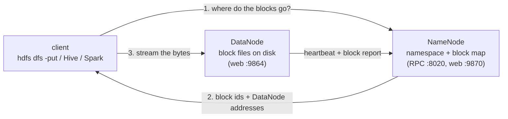

# HDFS: the Hadoop Distributed File System

## What it is

HDFS stores files across many machines as if they were one disk. A file is
cut into large **blocks** (128 MB by default) and each block is copied to
several **DataNodes** (3 copies by default, the **replication factor**). One
**NameNode** keeps the *metadata*: the directory tree, which blocks make up
each file, and which DataNodes hold each block. Clients ask the NameNode
where the blocks are, then read and write the bytes directly with the
DataNodes.



## Why UrbanFlow uses it

The medallion layers (bronze, silver, gold) are a data lake: files, not a
database. On one laptop they sit in `data/`. HDFS is where the same lake
lives on a cluster, so every other Hadoop tool (YARN tasks, MapReduce, Hive,
Spark) can read the same files from any machine, and a lost disk does not
lose data because each block has copies elsewhere.

## How it is set up here

| Setting | Value | Where |
|---|---|---|
| `fs.defaultFS` | `hdfs://namenode:8020` | `hadoop/conf/core-site.xml` |
| `dfs.replication` | `1` (only one DataNode) | `hadoop/conf/hdfs-site.xml` |
| `dfs.blocksize` | `134217728` (128 MB, the default) | `hadoop/conf/hdfs-site.xml` |
| NameNode metadata | Docker volume `urbanflow-hadoop_namenode` | `docker-compose.hadoop.yml` |
| DataNode blocks | Docker volume `urbanflow-hadoop_datanode` | `docker-compose.hadoop.yml` |

The NameNode formats itself on first start only (`ENSURE_NAMENODE_DIR`), and
`scripts/hadoop/hdfs-init.sh` creates `/tmp` (mode 1777, like Unix `/tmp`)
and `/user/hive/warehouse`, the two directories every Hadoop cluster needs.

## Layout in HDFS

`make hadoop-load` runs `scripts/hadoop/hdfs-load.sh`, which copies the local
layers in with `hdfs dfs -put`:

```text
/urbanflow/
  bronze/yellow/year=2025/yellow_2025-01.parquet   raw TLC file, as downloaded
  bronze/zones/taxi_zone_lookup.csv                265-row zone lookup
  silver/yellow/year=2025/month=1/part-*.parquet   cleaned trips, partitioned
  gold/yellow/<table>/part-*.parquet               Spark's answer tables (Tier 0)
  gold/fhvhv/<table>/part-*.parquet                real Tier 2 gold (TIER2_GOLD=...)
  staging/trips_tsv/                               text extract for MapReduce
  mr/zone_hour_counts/part-0000{0,1}               MapReduce output
/user/hive/warehouse/urbanflow.db/                 Hive-managed tables
/apps/tez/                                         Tez jars shipped to YARN containers
```

Real output from `make hadoop-load TIER2_GOLD=...` on Tier 0 (one month of
yellow taxis, 3.5M raw rows) plus the real Tier 2 gold tables:

```text
==> hdfs dfs -du -s -h (size per layer)
56.4 M   56.4 M   /urbanflow/bronze
86.7 M   86.7 M   /urbanflow/silver
356.5 K  356.5 K  /urbanflow/gold

==> replication factor and block size of the bronze file
1 replica(s)  block=134217728 bytes  size=59158238 bytes  yellow_2025-01.parquet

==> hdfs fsck /urbanflow -files -blocks (summary)
Status: HEALTHY
 Total size:	247053051 B
 Total files:	42
 Total blocks (validated):	26 (avg. block size 9502040 B)
 Default replication factor:	1
 Average block replication:	1.0
 Missing blocks:		0
 Corrupt blocks:		0
```

The two numbers in `du` are the logical size and the space used across all
replicas; with replication 3 the second would be three times the first.

## Commands worth showing

```bash
H="docker compose -p urbanflow-hadoop -f docker-compose.hadoop.yml exec namenode"
$H hdfs dfs -ls -R /urbanflow/silver            # the partition folders
$H hdfs dfs -du -h /urbanflow/gold/yellow       # size per gold table
$H hdfs fsck /urbanflow/bronze -files -blocks -locations   # which DataNode holds each block
$H hdfs dfsadmin -report                        # capacity, live DataNodes
$H hdfs dfs -cat /urbanflow/bronze/zones/taxi_zone_lookup.csv | head
```

The NameNode web UI at http://localhost:19870 shows the same (Utilities ->
Browse the file system).

## What to say when asked

* **"Why HDFS and not just a folder?"** A folder lives on one disk. HDFS
  spreads blocks over many machines and keeps copies, so storage and read
  bandwidth grow with the cluster, and losing a machine loses nothing.
  Computation can also be sent to the machine that holds the block (data
  locality) instead of moving the data.
* **"Why such big blocks?"** Fewer, larger blocks mean less metadata in the
  NameNode's memory and long sequential reads, which suits scanning big files.
  It is also why HDFS is bad at millions of tiny files.
* **"What happens if the NameNode dies?"** Here, the file system is
  unavailable until it restarts; its metadata is persisted in its volume, so
  nothing is lost. Production clusters run a standby NameNode (HA).
* **"Why replication 1?"** There is only one DataNode, so there is nowhere to
  put a second copy. `dfs.replication` is the one setting to change on a real
  cluster.
* **"Is the data changed on the way in?"** No. `hdfs dfs -put` copies the
  bytes exactly; bronze stays immutable, as in the local pipeline.
