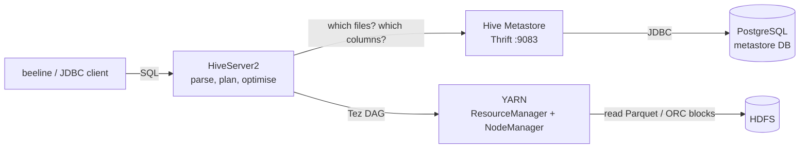

# Hive: SQL over the data lake

## What it is

Apache Hive lets you query files in HDFS with SQL (HiveQL). A Hive *table* is
not a copy of the data: it is a **schema plus an HDFS location**, stored in
the **metastore**. At query time Hive reads the files at that location,
applying the schema as it reads ("schema on read"), and compiles the query
into distributed jobs that run on YARN.

Three pieces run here:

| Container | Role |
|---|---|
| `hiveserver2` | accepts SQL over JDBC (`:10000`, what `beeline` connects to), plans each query, runs it on YARN |
| `hive-metastore` | the catalogue service (Thrift, `:9083`): databases, tables, columns, partitions, HDFS locations |
| `hive-metastore-db` | PostgreSQL, where the metastore keeps that catalogue |



### What the metastore database stores (and what it does not)

The Postgres database holds only **metadata**: database and table names,
column names and types, the storage format and SerDe (Parquet, ORC, CSV),
each table's **HDFS location**, every **partition** and its folder, table
statistics, and transaction state for ACID tables. It never holds the trip
data itself; that stays in HDFS. A 243.5-million-trip dataset and a
10-row one cost the metastore about the same.

A real Postgres (rather than Hive's default embedded Derby) is what makes it
a proper shared metastore: Derby allows one connection, so only one Hive
process could use the catalogue at a time. With Postgres, HiveServer2, the
metastore service, and any other engine (Spark, Presto/Trino) can share one
catalogue. You can look inside it:

```bash
docker compose -p urbanflow-hadoop -f docker-compose.hadoop.yml exec hive-metastore-db \
  psql -U hive -d metastore -c 'SELECT "TBL_NAME", "TBL_TYPE" FROM "TBLS" ORDER BY 1;'
```

### Execution engine: Tez on YARN

Hive 4 compiles each query into a **Tez DAG** (a graph of map and reduce
stages that can pass data directly between stages, instead of MapReduce's
fixed map -> reduce -> write to HDFS -> next job). The Tez ApplicationMaster
runs on YARN like any other job; `make hadoop-up` uploads the Tez jars to
`/apps/tez` in HDFS so YARN can ship them to containers
(`hive/conf/tez-site.xml`). Hive 4 still contains its old MapReduce engine,
but deprecates it, and in this stack it failed on a dynamic-partition insert,
so Tez is used. Our own MapReduce job ([mapreduce.md](mapreduce.md)) shows
classic MapReduce.

## Why UrbanFlow uses it

It gives SQL over the exact files the Spark pipeline wrote, without moving
or converting them, so the gold answers can be recomputed and checked by a
second engine, and anyone who knows SQL can explore the lake.

## The tables (`hive/queries/01_create_tables.sql`, `make hive-tables`)

All in database `urbanflow`:

| Table(s) | Over | Notes |
|---|---|---|
| `bronze_yellow_trips` | `/urbanflow/bronze/yellow` | raw TLC Parquet, TLC's own column names, partitioned by `year` |
| `bronze_zones` | `/urbanflow/bronze/zones` | the zone lookup CSV (`OpenCSVSerde`, header skipped) |
| `silver_trips` | `/urbanflow/silver/yellow` | cleaned trips, **partitioned by `year`, `month`**; `MSCK REPAIR TABLE` registers the folders Spark wrote |
| `gold_*` (7) | `/urbanflow/gold/yellow/<table>` | Spark's Tier 0 answer tables |
| `tier2_*` (6) | `/urbanflow/gold/fhvhv/<table>` | the real Tier 2 gold (243.5M FHVHV trips) and the GBT model's `duration_predictions` |
| `mr_zone_hour_counts` | `/urbanflow/mr/zone_hour_counts` | the MapReduce job's tab-separated output |
| `zone_hour_demand` | `/user/hive/warehouse/urbanflow.db/...` | **managed**, transactional ORC, partitioned by borough (`05_managed_partitioned.sql`) |

**External vs managed.** Every table except the last is `EXTERNAL`: Hive
records where the files are but does not own them, so `DROP TABLE` removes
only the metadata and Spark's files stay. `zone_hour_demand` is **managed**:
Hive writes its files into its own warehouse and `DROP TABLE` deletes them.
Since Hive 3, managed tables are transactional (ACID), with each write
recorded as a transaction in the metastore database.

**Partitions.** Spark wrote `silver/yellow/year=2025/month=1/`. The
`year=`/`month=` folder names become columns that are *not* stored inside
the files. A `WHERE year = 2025 AND month = 1` lets Hive skip every other
folder without opening it (partition pruning), which `EXPLAIN DEPENDENCY` in
`04_analytics.sql` shows. `05` creates partitions itself with a
**dynamic-partition insert**: one folder per distinct borough value.

## The queries (`make hive-query`)

| File | What it answers |
|---|---|
| `03_reproduce_gold.sql` | recomputes `daily_kpis`, `demand_by_zone_hour` and `tipping` from silver in HiveQL and compares every row with Spark's gold; compares the MapReduce output with Spark |
| `04_analytics.sql` | rows removed by cleaning (bronze vs silver), partition pruning, a join with the CSV zone table, and Tier 2 answers: rush-hour speeds, yearly totals, busiest OD pairs, the model's predicted durations |
| `05_managed_partitioned.sql` | the managed, ACID, ORC, dynamically partitioned table |

Real results from `make hive-query` (trimmed):

```text
-- 03 Q1: daily KPIs, Hive (from silver) next to Spark (gold)
|     h.d     | hive_trips  | spark_trips  | hive_revenue  | spark_revenue  | hive_avg_fare  | spark_avg_fare  |
| 2025-01-01  | 80132       | 80132        | 2281090.81    | 2281090.81     | 28.47          | 28.47           |
| 2025-01-02  | 79678       | 79678        | 2347201.75    | 2347201.75     | 29.46          | 29.46           |
| 2025-01-03  | 86113       | 86113        | 2409474.18    | 2409474.18     | 27.98          | 27.98           |

| days_compared  | trips_equal  | revenue_equal  | avg_fare_equal  | avg_duration_equal  |
| 31             | 31           | 31             | 31              | 31                  |

-- 03 Q2: demand by zone, hour, weekday/weekend
| groups_compared  | trips_equal  | only_in_one_side  |
| 10333            | 10333        | 0                 |

-- 03 Q3: the cash-tip finding, recomputed (identical to gold_tipping)
| pu_borough  |   payment   |  trips   | avg_tip_pct  | pct_trips_with_tip  |
| Manhattan   | card        | 2172575  | 26.82        | 95.54               |
| Manhattan   | cash/other  | 705037   | 1.5          | 6.83                |
| Queens      | card        | 193622   | 21.13        | 91.6                |
| Queens      | cash/other  | 71534    | 0.46         | 2.23                |

-- 04: rows removed by cleaning; partition pruning
| b.raw_rows  | s.clean_rows  | removed  | removed_pct  |
| 3475226     | 3218618       | 256608   | 7.384        |
{"input_tables":[{"tablename":"urbanflow@silver_trips","tabletype":"EXTERNAL_TABLE"}],
 "input_partitions":[{"partitionName":"urbanflow@silver_trips@year=2025/month=1"}]}

-- 04 Tier 2 (243.5M FHVHV trips): Manhattan weekday speed, a few hours
| pickup_hour  |  trips   | avg_speed_mph  |
| 4            | 730832   | 23.47          |
| 8            | 3337577  | 11.41          |
| 17           | 3689174  | 9.61           |

| days  |   trips    | revenue_billion_usd  | avg_fare  |
| 365   | 243506519  | 8.11                 | 33.32     |

-- 04: the GBT model's predicted minutes, 5-mile Manhattan trip, Wednesday
| pickup_hour  | predicted_min  |
| 4            | 17.2           |
| 8            | 23.8           |
| 17           | 27.2           |

-- 05: managed ACID ORC table, one partition per borough
| pu_borough=Bronx | pu_borough=Brooklyn | pu_borough=EWR | pu_borough=Manhattan |
| pu_borough=N%2FA | pu_borough=Queens | pu_borough=Staten Island | pu_borough=Unknown |
| Location:    | hdfs://namenode:8020/user/hive/warehouse/urbanflow.db/zone_hour_demand |
| Table Type:  | MANAGED_TABLE                                      |
|              | transactional                                      | true |
```

Spark and Hive, two different engines reading the same Parquet files in
HDFS, agree on every day, every zone-hour group and every tipping row.

## What to say when asked

* **"Is Hive a database?"** Not in the usual sense. It is a SQL engine and a
  catalogue over files. Storage is HDFS; execution is YARN (Tez here); Hive
  contributes the schema, the SQL compiler and the metastore.
* **"What is schema on read?"** The files are written without Hive knowing;
  the schema is applied when they are read. A traditional database checks
  the schema on write and refuses bad rows.
* **"What does the metastore store?"** Table and partition definitions,
  column types, file formats and HDFS locations, statistics, transaction
  state. Not the data.
* **"Why Postgres for the metastore?"** A real multi-client database, so
  several Hive services and other engines share one catalogue; the embedded
  Derby default allows only one connection.
* **"Why external tables?"** The files belong to the Spark pipeline, which
  may rewrite them. External tables let Hive read them without taking
  ownership, and dropping a table can never delete the data.
* **"Why Tez instead of MapReduce?"** A query with a join and a GROUP BY is
  several MapReduce jobs, each writing its result to HDFS for the next.
  Tez runs the same stages as one DAG and passes data between them directly,
  so it is much faster; Hive 4 makes it the default.
