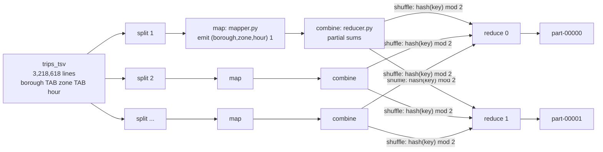

# MapReduce: trips per pickup zone per hour

## What it is

MapReduce is Hadoop's original processing model. You write two small
functions and the framework does everything else (splitting the input,
running tasks in parallel, moving data between them, retrying failures):

1. **Map**: read one input record, emit zero or more `(key, value)` pairs.
2. **Shuffle and sort** (the framework): group all pairs by key and deliver
   each key's values, sorted, to exactly one reducer.
3. **Reduce**: receive one key with all its values, emit the result.

An optional **combiner** is a "mini-reduce" run on each mapper's output
before the shuffle, to shrink what crosses the network.

## Why UrbanFlow uses it

"How many trips start in each zone in each hour?" is the demand question
behind the dashboard's busiest-zones view and the `demand_by_zone_hour` gold
table. It is a textbook MapReduce job (a word count with a composite key),
so it shows the model clearly, and its answer can be checked against what
Spark computed for the same data.

## The job

| Piece | File |
|---|---|
| Input: a text extract of the silver layer, written by Hive | `hive/queries/02_export_for_mapreduce.sql` -> `/urbanflow/staging/trips_tsv` |
| Mapper | `hadoop/mapreduce/mapper.py` |
| Reducer (also the combiner) | `hadoop/mapreduce/reducer.py` |
| Submission (Hadoop Streaming) | `scripts/hadoop/mr-zone-hour.sh` |
| Output | `/urbanflow/mr/zone_hour_counts/part-00000`, `part-00001` |

**Hadoop Streaming** runs any program as mapper/reducer: each task pipes its
input lines to the script's stdin and reads `key TAB value` lines from its
stdout. That is how a Python script becomes a MapReduce job without writing
Java. The scripts use only the standard library and run on Python 2.7 (what
the `apache/hadoop` image ships) and Python 3.



Mapper, in full:

```python
for line in sys.stdin:
    fields = line.rstrip("\n").split("\t")
    if len(fields) != 3:
        sys.stderr.write("reporter:counter:UrbanFlow,MalformedLines,1\n")
        continue
    borough, zone, hour = fields
    sys.stdout.write("%s\t%s\t%s\t1\n" % (borough, zone, hour))
```

The reducer relies on the sort: all lines for one key arrive one after
another, so it keeps a running total and prints it whenever the key changes.

The options that matter (`scripts/hadoop/mr-zone-hour.sh`):

| Option | Why |
|---|---|
| `stream.num.map.output.key.fields=3` | the key is `borough, zone, hour`, not just the first field |
| `stream.num.reduce.output.key.fields=3` | the same for the combiner's output lines, which Streaming re-parses; left at the default of 1 the key silently shrinks to the borough and one zone-hour gets split into several output lines (a real bug we hit and fixed) |
| `-combiner "python reducer.py"` | safe because addition is associative: summing partial sums gives the same total |
| `mapreduce.job.reduces=2` | two reducers, each owning the keys whose hash lands on it |
| `mapreduce.job.maps=4` | a hint for how many input splits to cut, so several mappers run in parallel |

## Real run

`make hadoop-mr` (trimmed):

```text
==> input: the text extract in HDFS, and how it is stored in blocks
91.9 M  91.9 M  /urbanflow/staging/trips_tsv
/urbanflow/staging/trips_tsv/000000_0 29965164 bytes, replicated: replication=1, 1 block(s):  OK
/urbanflow/staging/trips_tsv/000001_0 30134651 bytes, replicated: replication=1, 1 block(s):  OK
/urbanflow/staging/trips_tsv/000002_0 36298015 bytes, replicated: replication=1, 1 block(s):  OK

==> submitting the streaming job to YARN
Submitted application application_1790533754950_0010
 map 0% reduce 0%
 map 33% reduce 0%
 map 100% reduce 0%
 map 100% reduce 100%
Job job_1790533754950_0010 completed successfully
		Launched map tasks=6
		Launched reduce tasks=2
		Map input records=3218618
		Map output records=3218618
		Combine input records=3218618
		Combine output records=23441
		Reduce shuffle bytes=758812
		Reduce input records=23441
		Reduce output records=5558

==> busiest pickup zone-hours (borough, zone, hour, trips)
Manhattan	Midtown Center	18	15837
Manhattan	Midtown Center	17	15285
Manhattan	Upper East Side North	15	13044
Manhattan	Midtown Center	19	12839
Manhattan	Upper East Side South	14	12734
```

What the counters show: six map tasks (two input splits per file) turned
every input line into one map output record; the combiner collapsed those
3.2 million records into 23,441 partial sums before the shuffle, so under
1 MB crossed to the reducers instead of ~100 MB; the two reducers emitted one
line per (borough, zone, hour), 5,558 in all.

## Checked against Spark

`hive/queries/03_reproduce_gold.sql` (Q4) reads the MapReduce output as the
Hive table `mr_zone_hour_counts` and joins it with Spark's
`demand_by_zone_hour` gold table (summed over weekday/weekend):

```text
+----------------------+---------------+-------------------+------------------------+--------------------+
| zone_hours_compared  | counts_equal  | only_in_one_side  | mapreduce_total_trips  | spark_total_trips  |
+----------------------+---------------+-------------------+------------------------+--------------------+
| 5558                 | 5558          | 0                 | 3218618                | 3218618            |
+----------------------+---------------+-------------------+------------------------+--------------------+
```

Every zone-hour count agrees, and both sides add up to the 3,218,618 trips
in the silver layer.

## What to say when asked

* **"Why is there a sort between map and reduce?"** So that a reducer sees
  each key's values together without holding every key in memory; it can
  stream through them one key at a time.
* **"What decides which reducer gets a key?"** The partitioner:
  `hash(key) mod number_of_reducers`. The same key always goes to the same
  reducer, which is why each count appears exactly once in the output.
* **"When is a combiner safe?"** When the reduce operation is associative
  and commutative (sum, count, max). An average is not: the average of
  partial averages is wrong unless you carry (sum, count) pairs.
* **"Why is the input text, not Parquet?"** Streaming hands the script plain
  lines. Hive writes the text extract straight into HDFS from the Parquet
  silver table, one example of the tools working over the same storage.
* **"Why is MapReduce slower than Spark?"** It writes intermediate results
  to disk between every stage and starts a JVM per task; Spark keeps data in
  memory across stages. MapReduce's strength is that it is simple and very
  robust on huge batch jobs.
