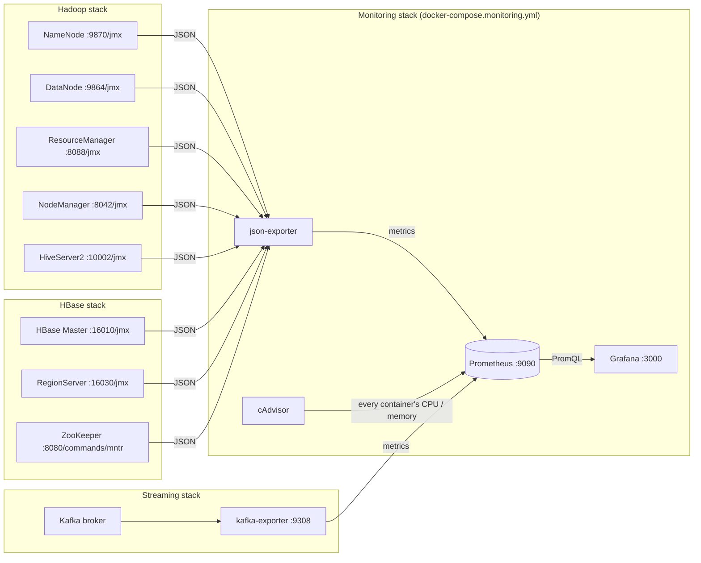

# Monitoring: Prometheus + Grafana

UrbanFlow's big-data side runs as several separate Docker stacks: Hadoop core
(HDFS, YARN, Hive), HBase with ZooKeeper, and Kafka with Spark Structured
Streaming. The monitoring stack watches all of them from one place: is each
daemon up, how full HDFS is, how many YARN apps are running, how many requests
HBase is serving, how fast messages flow through Kafka, and how much CPU and
memory every container uses.

It is opt-in. The normal `docker compose up --build` and the `make` pipeline
do not start it and do not need it.

## Run it

```bash
make monitor-up        # Prometheus + Grafana + cAdvisor + json-exporter
make monitor-status    # every scrape target and whether it is up
make monitor-down      # stop it (data volumes are kept)
```

| What | Where |
|---|---|
| Grafana | <http://localhost:3000>, opens on the Overview dashboard. Viewing needs no login; `admin` / `urbanflow` to edit. |
| Prometheus | <http://localhost:9090>. `/targets` lists every scrape, `/alerts` the alert rules. |

Port clash? `GRAFANA_PORT=3300 PROMETHEUS_PORT=9095 make monitor-up`
(also pass them to `make monitor-status` / `monitor-reload`).

Start it before or after the other stacks, in any order. A stack that is not
running just shows as DOWN until it starts; nothing has to be restarted.

## Components

| Component | What it is | Why UrbanFlow uses it |
|---|---|---|
| **Prometheus** | A time-series database that *pulls* ("scrapes") metrics over HTTP from every target every 15 s, stores them, and answers queries in PromQL. Also evaluates alert rules. | One store for the health numbers of every stack, with history, so we can show what happened during a job, not just "now". |
| **Grafana** | A dashboard web app. It holds no data; every panel is a PromQL query sent to Prometheus. | The visual we present. Its datasource and dashboards are provisioned from files in the repo, so it works on first start with no clicking. |
| **cAdvisor** | Google's container monitor. Reads each container's cgroup counters from the Docker host. | Per-container CPU, memory and network for every stack, including daemons that have no metrics of their own. |
| **json-exporter** | Fetches a JSON document on each scrape and turns chosen fields into Prometheus metrics. | Hadoop, Hive and HBase publish metrics as JSON at `/jmx`, and ZooKeeper at `/commands/mntr`. This reads them with no change to those stacks and no Java agent. |
| **kafka-exporter** | Connects to Kafka as a client and exposes topic offsets and consumer-group lag. | Kafka throughput and lag. It ships with the streaming stack (`docker-compose.streaming.yml`), which is where it can reach the broker; Prometheus scrapes it on port 9308. |

## Architecture



**How a scrape reaches another stack.** Each stack is its own compose project
with its own Docker network, and the monitoring stack deliberately joins none
of them. Every stack already publishes its web UI ports on the host (that is
how you open the NameNode UI at localhost:9870), so Prometheus and
json-exporter reach them at `host.docker.internal:<port>`. That is what lets
monitoring start whether zero, one or all stacks are up: if a network were
declared `external`, compose would refuse to start until that stack existed.

**How the JSON gets in.** For a `/jmx` target, Prometheus does not call the
daemon directly. The relabel rules in `monitoring/prometheus/prometheus.yml`
turn the target into a request to
`json-exporter:7979/probe?module=namenode&target=http://host.docker.internal:9870/jmx`.
json-exporter downloads the JMX JSON, applies the JSONPath expressions of
that module (`monitoring/json-exporter/config.yml`), and answers with plain
Prometheus metrics such as `hdfs_live_datanodes 1`. If the daemon is down,
json-exporter answers 503 and Prometheus records `up = 0` for that target.

## Data flow, one number end to end

Take "HDFS live DataNodes" on the Hadoop dashboard:

1. The NameNode keeps an internal JMX bean
   `Hadoop:service=NameNode,name=FSNamesystemState` with an attribute
   `NumLiveDataNodes`, and serves all beans as JSON at `:9870/jmx`.
2. Every 15 s Prometheus asks json-exporter to probe that URL with module
   `namenode`.
3. json-exporter selects the bean with
   `{.beans[?(@.name=="Hadoop:service=NameNode,name=FSNamesystemState")]}`
   and emits `hdfs_live_datanodes`.
4. Prometheus stores the sample with labels `stack="hadoop"`,
   `component="namenode"`.
5. The Grafana stat panel runs the PromQL query `hdfs_live_datanodes` and
   shows the latest value, red if it is 0.

## Dashboards

All four are in the **UrbanFlow** folder in Grafana and link to each other
from the top-right menu.

| Dashboard | Panels |
|---|---|
| **Overview** | Targets up / expected per stack; a table of every endpoint (UP/DOWN); containers running, total CPU and memory; firing alerts; CPU, memory and network per container. |
| **Hadoop** | Each daemon UP/DOWN; live DataNodes; HDFS used %, capacity, files, blocks, under-replicated and missing blocks; YARN active NodeManagers, apps running / pending / completed / failed, memory allocated vs. available, running containers; JVM heap per daemon. |
| **HBase + ZooKeeper** | Master / RegionServer / ZooKeeper UP/DOWN; live and dead RegionServers; regions in transition; regions, store files, data size, MemStore; reads and writes per second; ZooKeeper znodes, connections, latency; JVM heap. |
| **Kafka + Spark Streaming** | Brokers; messages per second per topic; messages retained; consumer lag per group and topic; consumer progress; CPU and memory of the streaming containers (Kafka broker, producer, Spark job). |

The dashboard JSON is generated: edit `scripts/build_dashboards.py`, then run
`make monitor-dashboards`. `make test` fails if the two drift apart, and also
if a panel queries a metric that no exporter produces.

## Alerts

`monitoring/prometheus/alerts.yml`. No Alertmanager is configured (nothing to
page in a demo); firing alerts appear at <http://localhost:9090/alerts> and in
the Overview dashboard's *Firing alerts* table.

| Alert | Fires when |
|---|---|
| TargetDown (info) | any endpoint has not answered for 2 min, which includes a stack you have not started |
| HdfsDeadDataNodes | the NameNode counts a dead DataNode |
| HdfsMissingBlocks | a block has no live replica, so some file cannot be read |
| HdfsCapacityHigh | HDFS more than 85 % full for 5 min |
| YarnNoNodeManagers | ResourceManager has no NodeManager to run containers on |
| HbaseDeadRegionServers | the Master counts a dead RegionServer |
| KafkaConsumerLagHigh | a consumer group is more than 10,000 messages behind for 5 min |

## Viva: "why this component?"

**Why Prometheus and not just the Hadoop / HBase web UIs?** Each UI shows one
daemon, right now. Prometheus stores every daemon's numbers over time in one
place, so one query can compare them and a graph shows what happened while a
job ran. It is also the de facto standard for this: Kafka, Spark, Hadoop and
HBase all have Prometheus exporters or endpoints.

**Why pull (scrape) instead of each service pushing?** The monitor decides
what and how often. A target that stops answering is noticed immediately
(`up = 0`) instead of looking the same as "nothing to report". Adding a
service is a line in `prometheus.yml`, not a code change in that service.

**Why Grafana?** Prometheus stores and queries; Grafana visualises. Keeping
them apart means dashboards can be rebuilt without touching the data.
Provisioning from files means the dashboards are code in the repo, reviewed
like code, and identical on every machine.

**Why cAdvisor?** It measures from the outside, through the kernel's cgroups,
so it covers every container, even ones with no metrics endpoint. It answers
"which container is eating the laptop's memory" for all stacks at once.

**Why json-exporter instead of the JMX exporter agent?** The usual way to get
Hadoop metrics into Prometheus is a Java agent jar added to each daemon's
start command. That would mean changing every other stack's image and config.
Every Hadoop-family daemon already serves its JMX beans as JSON over HTTP, so
converting that JSON outside the daemon gives the same numbers with zero
changes to those stacks.

**What is the difference between a metric, a target and a job?** A *target*
is one URL Prometheus scrapes (the NameNode). A *job* is a group of targets
with the same config (`hadoop`). A *metric* is one named number coming back
(`hdfs_live_datanodes`), and labels such as `stack` and `component` say where
it came from.

**What does `rate()` do?** Counters like "total messages written" only go up.
`rate(x[1m])` turns that into "per second over the last minute", which is how
the Kafka throughput and HBase requests-per-second panels are drawn.

## Honest limits

* One machine, one Prometheus, three days of retention (`--storage.tsdb.retention.time=3d`).
  A production setup would add Alertmanager and long-term storage.
* `host.docker.internal` is built into Docker Desktop (macOS / Windows); on
  Linux the compose file maps it to the host gateway, which needs Docker 20.10+.
* cAdvisor needs `privileged` and read-only mounts of the Docker host's
  `/sys`, `/var/lib/docker` and the containerd socket; on Docker Desktop's
  containerd image store it cannot name containers without that socket.
* Spark Structured Streaming keeps its Kafka offsets in its own checkpoint
  and does not commit them to a Kafka consumer group, so kafka-exporter
  cannot compute its lag. The streaming dashboard shows Spark's progress
  through the output topic's throughput and the job container's CPU / memory
  instead.
* ZooKeeper's `/commands/mntr` is served by its AdminServer (port 8080 in the
  container). It is only scraped if the HBase stack publishes that port.
