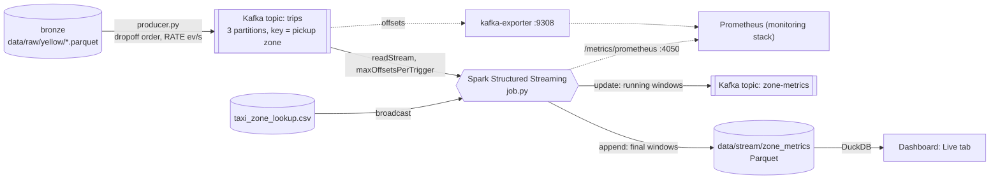

# Real-time path: Apache Kafka + Spark Structured Streaming

The batch pipeline answers questions about a finished month. This path
answers "what is happening in each pickup zone right now". It uses the same
cleaning rules, the same zone join and the same Spark, but runs them
continuously over a stream of trip events.

It is opt-in. `docker compose up`, the Quickstart and the dashboard on
:8501 work exactly as before whether or not Kafka is running.

## Architecture



Inside the Spark job, every trigger (default 10 s) does:

```
Kafka records (binary)
  -> parse      from_json into the curated column names        job.parse
  -> clean      curate.clean.derive + all 7 curate.rules       job.clean
  -> watermark  withWatermark("pickup_ts", "30 minutes")
  -> enrich     broadcast join to the zone lookup              job.zone_metrics
  -> aggregate  groupBy(window(pickup_ts, 5 min), zone): trips, avg fare,
                avg duration, avg distance, revenue, avg card tip %
  -> sinks      Parquet (append) and Kafka zone-metrics (update)
```

## What each piece is and why it is here

| Piece | What it is | Why UrbanFlow uses it |
|---|---|---|
| **Apache Kafka 3.9** (`apache/kafka:3.9.1`) | A distributed, append-only, partitioned log. Producers append records and consumers read them at their own pace, each tracking its own position (offset). | It decouples the thing producing trips from the thing analysing them. Events are kept on disk, so the Spark job can stop, crash or fall behind and then resume from where it was without losing trips. |
| **KRaft mode** | Kafka managing its own cluster metadata through a Raft quorum of controllers. | Older Kafka needed a separate ZooKeeper cluster. Here a single process is both the broker and the controller: one container, no ZooKeeper. (The HBase task still runs ZooKeeper, because HBase needs it.) |
| **Topic `trips`** (3 partitions) | The input stream: one JSON event per trip. | Partitions are Kafka's unit of parallelism. The Spark source reads each partition as its own task. The record key is the pickup zone, so every event for a zone goes to the same partition and stays in order. |
| **Topic `zone-metrics`** (3 partitions) | The output stream: windowed metrics as JSON. | Any other service (an alerting job, another dashboard) can subscribe to live results without touching Spark. |
| **producer.py** | Reads bronze Parquet with pyarrow and sends trips to Kafka at a fixed rate (kafka-python, `acks=all`). | Real TLC data only arrives as monthly files, so we replay it as if it were live. |
| **Spark Structured Streaming** | Spark's streaming engine: a query on an unbounded table, executed as a series of small batch jobs (micro-batches). | It is the same DataFrame API as curate/gold. `derive()` and `rules()` are imported unchanged, so batch and stream cannot drift apart. |
| **Checkpoint** (`data/stream/_checkpoints/<query>`) | Per query: the Kafka offsets of each batch, plus the aggregation state (open windows). | This gives restart and exactly-once output. Kill the job and start it again, and it carries on from the next unprocessed offset with its open windows restored. |
| **kafka-exporter** (`danielqsj/kafka-exporter:v1.9.0`) | Exposes Kafka state as Prometheus metrics at `:9308/metrics`. | Lets the monitoring stack graph topic throughput and consumer lag. |

## Key streaming ideas (the part examiners ask about)

**Event time vs ingestion time vs processing time.** Each event carries
three times:

- `pickup_ts` is the **event time**: when the trip really started.
- The Kafka record timestamp is the **ingestion time**: when the producer
  sent it (Spark shows it as `kafka_ts`).
- The **processing time** is when Spark gets to the event.

The windows use event time. So a trip replayed today still lands in its real
January 2025 window, and results do not depend on how fast the replay runs.

**Why the producer sends trips in dropoff order.** A trip record only exists
once the meter stops. A 50-minute trip is therefore reported after many short
trips that started later than it did. Sending in dropoff order but windowing
on pickup time produces realistic out-of-order data.

**Watermark.** `withWatermark("pickup_ts", "30 minutes")` means: *the
watermark is the latest event time seen, minus 30 minutes*. It does two jobs:

1. Events older than the watermark are **late** and are dropped.
2. Any window that ends before the watermark can never change again. Spark
   emits it (in append mode) and deletes its state. Without a watermark, the
   state for every window ever seen would grow forever.

**Clean before the watermark.** The real bronze files contain stray 2001
and 2098 timestamps. If one 2098 event reached `withWatermark`, the watermark
would jump 73 years ahead and every real trip after it would be dropped as
late. That is why `clean()` (including the `out_of_month` rule) runs first:
dirty rows never reach the watermark. `tests/test_stream.py` checks this.

**Output modes.**
- **append** (the Parquet sink): each window is written once, only after the
  watermark has passed its end, so every row on disk is final. The newest
  ~30 minutes of event time are still open and not on disk yet.
- **update** (the Kafka sink): every trigger emits the windows whose numbers
  changed in that batch. Consumers see early, running answers that later
  messages may revise.

**Exactly-once.** The Parquet file sink plus the checkpoint give exactly-once
output. Each batch's offsets are logged before it runs, and each batch's
files are committed in `zone_metrics/_spark_metadata/`. A batch that is
retried after a crash does not produce duplicate rows. Readers should use
that log (Spark does). A plain `*.parquet` glob would also pick up an
uncommitted file left by a batch that crashed mid-write, so the Live tab
reads only the files the log lists as committed (it falls back to the glob
only when the log does not exist). The Kafka
sink is at-least-once: consumers may see a repeated update after a restart.

**Stream-static join.** The 265-row zone lookup is a static DataFrame that
is broadcast to every task and joined to each micro-batch. It is the same
broadcast join curate uses.

**Backpressure.** `maxOffsetsPerTrigger=50000` caps each micro-batch. After
a long stop, the job catches up in bounded steps instead of one huge batch.

**State partitions.** For a stateful query, `spark.sql.shuffle.partitions`
is the number of state-store partitions, and it is fixed in the checkpoint
on first run. The job uses 4, not the batch default of cores × 8, because
64 tiny state tasks every 10 seconds is pure overhead on a laptop.

**Consumer groups and lag.** Spark's Kafka source stores offsets in its
checkpoint, not in a Kafka consumer group. Standard Kafka tooling would
therefore show nothing. The job's `Progress` listener copies each query's
processed offsets to the group `urbanflow-<query name>` after every batch.
This is for visibility only, so that `kafka-consumer-groups.sh` and
kafka-exporter can show lag. The checkpoint remains the source of truth on
restart.

## Running it

```bash
make setup                 # once (installs kafka-python with the rest)
make ingest TIER=0         # or make synth — the producer replays this bronze file
make stream-up             # Kafka + kafka-exporter; creates topics trips, zone-metrics
make stream-run            # terminal 1 — runs until Ctrl-C
make stream-produce        # terminal 2 — 300,000 trips at 2,000 events/s
make stream-status         # topics + consumer-group lag
make stream-tail           # five messages from zone-metrics
make stream-down           # stop containers, keep Kafka data and data/stream
make stream-reset          # stop AND delete Kafka's volume, checkpoints, data/stream
```

Useful knobs:

- Producer: `RATE=` (events/s, `0` = as fast as possible), `LIMIT=` (trips,
  `0` = the whole month), `SKIP=` (continue an earlier replay).
- Job: `STREAM_ARGS="--watermark '10 minutes' --trigger '5 seconds'"`,
  `--available-now` (process what is in the topic, then stop),
  `--sinks parquet`.

The first `stream-run` downloads the Spark–Kafka connector (about 60 MB,
into `~/.ivy2.5.2`), so it needs network access once.

### Real output from this machine (Tier 0, yellow 2025-01)

`make stream-produce` (300,000 trips at 2,000 events/s):

```
producer: 300,000 yellow trips from 2025-01 -> topic 'trips' @ localhost:9092, 2,000 events/s
  sent   290,262/300,000    2,000 ev/s  dropoff clock 2025-01-04T12:06:02
producer: done, 300,000 events in 150.0s (2,000 ev/s)
```

At that rate the replay runs about 2,000× faster than real life: 150 seconds
of wall clock cover 3.5 days of January.

`make stream-run`, one line per micro-batch:

```
  [zone_metrics_parquet] batch 1: 6,591 rows (6,241 rows/s) watermark=1970-01-01T00:00:00.000Z state_rows=870 late_dropped=0 offsets_behind=0
  [zone_metrics_parquet] batch 15: 20,023 rows (23,229 rows/s) watermark=2025-01-03T23:45:54.000Z state_rows=5411 late_dropped=0 offsets_behind=0
  [zone_metrics_parquet] batch 16: 13,378 rows (8,152 rows/s) watermark=2025-01-04T10:51:40.000Z state_rows=2046 late_dropped=0 offsets_behind=0
```

`make stream-status` during the replay (lag is about one trigger's worth of
events):

```
GROUP                          TOPIC  PARTITION  CURRENT-OFFSET  LOG-END-OFFSET  LAG
urbanflow-zone_metrics_parquet trips  2          61297           63970           2673
urbanflow-zone_metrics_parquet trips  1          38681           40143           1462
urbanflow-zone_metrics_parquet trips  0          46610           48235           1625
```

`make stream-tail`:

```
239	{"window_start":"2025-01-01T00:10:00.000Z","window_end":"2025-01-01T00:15:00.000Z","PULocationID":239,"pu_borough":"Manhattan","pu_zone":"Upper West Side South","trips":20,"avg_fare":14.62,"avg_duration_min":12.22,"avg_distance":2.36,"total_revenue":473.38,"avg_card_tip_pct":32.08}
```

Querying the Parquet sink with DuckDB after that run: 50,905 zone-windows
covering 275,505 trips. The difference from the 300,000 sent is the rows the
cleaning rules rejected, plus the newest windows that were still open.

### Two experiments worth showing live

**Late data.** Replay slowly with a short watermark:

```bash
make stream-run STREAM_ARGS="--watermark '10 minutes' --trigger '5 seconds' --sinks parquet"
make stream-produce RATE=200 LIMIT=20000
```

Batches of about 1,000 events now cover about 7 minutes of event time. Any
trip longer than the watermark arrives too late:

```
  [zone_metrics_parquet] batch 11: 1,003 rows (2,533 rows/s) watermark=2025-01-01T01:21:10.000Z state_rows=184 late_dropped=149 offsets_behind=0
```

`late_dropped` counts the rows the state store rejected. Spark pre-aggregates
each batch before that step, so one rejected row can stand for several trips.
With the default 30-minute watermark and 2,000 events/s, it stays at 0.

**Crash and resume.**

```bash
make stream-produce RATE=0 LIMIT=30000
make stream-run STREAM_ARGS=--available-now       # batch 0: 30,000 rows
make stream-produce RATE=0 LIMIT=10000 SKIP=30000
make stream-run STREAM_ARGS=--available-now       # batch 2: 10,000 rows, same query ids
```

The second run reads only the 10,000 new events. Its watermark continues
from the first run (`2025-01-01T04:17:27`) because the checkpoint restored
the offsets and the open windows.

## Monitoring endpoints (for the Prometheus/Grafana stack)

| Endpoint | From the host | From a container | What it has |
|---|---|---|---|
| kafka-exporter | `localhost:9308/metrics` | `kafka-exporter:9308` on the Docker network `urbanflow-streaming` | `kafka_brokers`, `kafka_topic_partition_current_offset` (use `rate()` for messages/s), `kafka_consumergroup_lag`, `kafka_consumergroup_lag_sum{consumergroup="urbanflow-zone_metrics_parquet"}` |
| Spark streaming job | `localhost:4050/metrics/prometheus/` (trailing slash) | `host.docker.internal:4050` | `metrics_urbanflow_stream_driver_spark_streaming_<query>_{inputRate_total,processingRate_total,latency,eventTime_watermark,states_rowsTotal,states_usedBytes}_Value`, where `<query>` is `zone_metrics_parquet` or `zone_metrics_kafka` |
| Spark UI | `localhost:4050` | | "Structured Streaming" tab: input rate, processing rate and batch duration charts |

The Spark endpoint only exists while `make stream-run` is running. The job
runs on the host, not in Docker. The metric prefix is stable across runs
because `spark.metrics.namespace=urbanflow_stream`.

Example scrape config:

```yaml
- job_name: kafka
  static_configs: [{targets: ["kafka-exporter:9308"]}]
- job_name: spark-streaming
  metrics_path: /metrics/prometheus/
  static_configs: [{targets: ["host.docker.internal:4050"]}]
```

## Likely viva questions

**Why Kafka, and not just have Spark watch a folder of files?** Spark can
stream from a folder, but then the folder is the only buffer and there is
one reader. Kafka keeps an ordered, replayable log with per-consumer
offsets. Many independent consumers (our two queries, the exporter, anyone
reading `zone-metrics`) read the same events at their own pace. It also
partitions the data for parallel reads.

**Why KRaft?** It is the current Kafka architecture. ZooKeeper support was
deprecated and is removed in Kafka 4.0. It also means one container fewer.

**Why Structured Streaming and not the old DStreams, or Flink?** DStreams
is Spark's legacy streaming API. It has no event time and no watermarks.
Structured Streaming reuses our batch DataFrame code as-is, which is the
whole argument for it here. Flink is a fine engine, but it would be a second
engine with a second copy of the cleaning rules.

**Is this "real" real-time?** It is micro-batch, with a latency of about one
trigger (10 s) plus under 1 s of processing (the `latency` metric was
565–989 ms at 2,000 events/s). That suits dashboards. Millisecond latency would need Spark's
continuous mode or a different engine.

**What if the job crashes?** Restart it. The checkpoint has the last
committed offsets and the window state, so it re-reads from Kafka exactly
where it stopped (see "Crash and resume" above). Kafka keeps the events for
7 days by default, so the job can be down for a long time without losing
data.

**Why 30 minutes of watermark?** It is a trade-off. A longer watermark
accepts more late trips, but results arrive later and more windows are held
in memory. Most NYC taxi trips are under 30 minutes, so almost all trips
still count, and a window is final about 30 minutes of event time after it
closes.

**Why are the Parquet numbers final but the Kafka ones not?** Append versus
update output mode (see above).

**Why 3 partitions and replication factor 1?** Three partitions give three
parallel read tasks, which is enough on a laptop. Replication is 1 because
there is one broker. In production you would run at least 3 brokers with
replication 3 and `min.insync.replicas=2`.

## Honest limitations

- Single broker, replication factor 1, Spark in local mode. This shows the
  concepts; it is not a fault-tolerant cluster.
- The input is a replay of historical data, deliberately sped up.
- The producer and the job run from the host venv. Inside the dev container,
  `localhost:9092` is not the host's Kafka, so run the streaming targets on
  the host (or in WSL2 on Windows).
- If host port 9092 or 9308 is taken, set `KAFKA_HOST_PORT` /
  `KAFKA_EXPORTER_PORT` before `make stream-up`, and set
  `URBANFLOW_KAFKA=localhost:<port>` for the producer and the job.
- After deleting only Kafka's volume, the old checkpoints point at offsets
  that no longer exist, and the job stops with a data-loss error. Use
  `make stream-reset`, which clears both.

## Files

```
docker-compose.streaming.yml   Kafka (KRaft) + kafka-exporter, network urbanflow-streaming
src/urbanflow/stream/producer.py
src/urbanflow/stream/job.py
src/urbanflow/stream/sink.py     committed-file list from _spark_metadata (used by the Live tab)
src/urbanflow/dashboard/live.py  the Live tab
tests/test_stream.py             parsing, cleaning-before-watermark, windows, card-only tips
tests/test_sink.py               committed-file log parsing, compact files, orphaned part files
```
