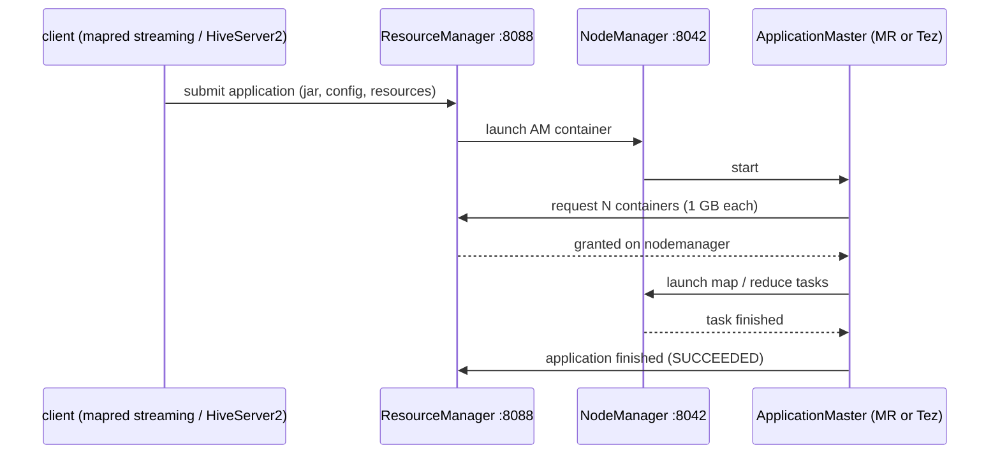

# YARN: Yet Another Resource Negotiator

## What it is

YARN is the cluster's operating system for jobs. It decides *which machine
runs which piece of work, with how much memory and CPU*. It has two daemons:

* **ResourceManager** (one per cluster): knows every machine's free memory and
  cores, accepts job submissions, and grants **containers** (a slice of one
  machine: e.g. 1 GB and 1 vcore) through its scheduler.
* **NodeManager** (one per worker machine): launches and watches the
  containers on its machine and reports back.

Every job gets its own **ApplicationMaster** (AM), itself running in a
container, which asks the ResourceManager for more containers for its tasks.
YARN does not know what MapReduce or Tez or Spark *are*; each brings its own
AM. That is why one YARN cluster serves all of them.



## Why UrbanFlow uses it

Both processing engines in this stack run on it: our hand-written MapReduce
job (`make hadoop-mr`) and every Hive query (Hive compiles SQL into Tez
DAGs). Without YARN, each would need its own cluster manager.

## How it is set up here

`hadoop/conf/yarn-site.xml`:

| Setting | Value | Why |
|---|---|---|
| `yarn.resourcemanager.hostname` | `resourcemanager` | where NodeManagers and clients find the RM |
| `yarn.nodemanager.resource.memory-mb` | `6144` | memory the one NodeManager offers to containers |
| `yarn.nodemanager.resource.cpu-vcores` | `4` | cores it offers |
| `yarn.scheduler.minimum-allocation-mb` | `512` | smallest container |
| `yarn.nodemanager.aux-services` | `mapreduce_shuffle` | the service reducers use to fetch map output |
| `yarn.log-aggregation-enable` | `true` | container logs are copied into HDFS after a job, so `yarn logs` works |

The scheduler is the default **CapacityScheduler** with one queue,
`root.default`. The MapReduce **JobHistory server** (`historyserver`
container, http://localhost:19888) keeps counters and logs of finished
MapReduce jobs after their AM has exited.

## Seeing it work

```bash
H="docker compose -p urbanflow-hadoop -f docker-compose.hadoop.yml exec resourcemanager"
$H yarn node -list                              # the NodeManager, RUNNING
$H yarn application -list -appStates ALL        # every job: MapReduce and Tez
$H yarn logs -applicationId application_...     # a finished job's container logs
```

Real output after `make hadoop-demo`: the MapReduce job and the Hive Tez
sessions side by side on the same cluster:

```text
$ yarn application -list -appStates ALL      (columns trimmed)
application_1790533754950_0010  UrbanFlow: trips per pickup zone per hour  MAPREDUCE  root  FINISHED  SUCCEEDED
application_1790533754950_0008  HIVE-227eba37-b0df-4e4c-9232-c678887cfec9  TEZ        hive  FINISHED  SUCCEEDED
application_1790533754950_0007  HIVE-1a9bbc3e-15b4-455a-b868-60feb1c23d10  TEZ        hive  FINISHED  SUCCEEDED
application_1790533754950_0003  HIVE-c8983114-7a33-43ff-b8df-3caaf39d2c0a  TEZ        hive  FINISHED  SUCCEEDED

$ yarn node -list
         Node-Id	     Node-State	Node-Http-Address	Number-of-Running-Containers
nodemanager:33953	        RUNNING	 nodemanager:8042	                           3
```

The ResourceManager UI at http://localhost:18088 shows the same list, with
each application's containers, memory and timeline.

## What to say when asked

* **"What is a container?"** A reserved slice of one machine's memory and
  CPU in which YARN runs one process (a map task, a reducer, an AM).
* **"Why did Hadoop 2 split YARN out of MapReduce?"** In Hadoop 1 the
  JobTracker did both scheduling and MapReduce bookkeeping, so it was a
  bottleneck and the cluster could only run MapReduce. YARN separates
  resource management (RM/NM) from each framework's logic (its AM), so
  MapReduce, Tez, Spark and others share one cluster.
* **"What does the ApplicationMaster do?"** It is the job's own coordinator:
  it splits the work into tasks, asks for containers, restarts failed tasks,
  and reports progress. The RM only hands out resources.
* **"Where is data locality?"** The AM asks for containers on the machines
  that hold the input blocks (it learns that from the NameNode). With one
  node, every task is local.
